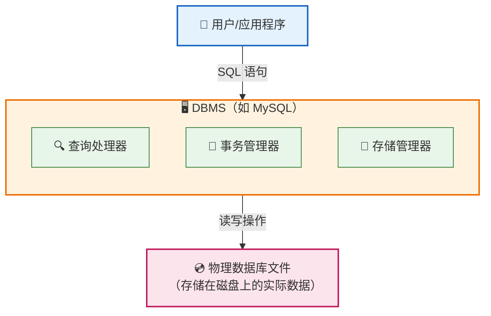
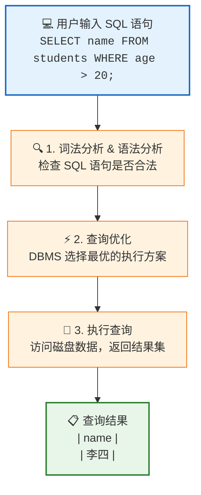

# 第一章：数据库基础入门

本章将介绍数据库的基本概念，帮助你理解什么是数据库、它与电子表格的区别，以及 DBMS 和 SQL 的作用。通过本章学习，你将建立对数据库系统的整体认识。

## 1. 什么是数据库

### 1.1 数据库的定义

**数据库（Database）** 是按照数据结构来组织、存储和管理数据的仓库。它是一个有组织的、可长期存储的数据集合，旨在高效地存储、检索和管理大量信息。

想象一下，当你管理一个班级的学生信息时：

- **没有数据库的情况**：你可能需要在纸上记录，或者在 Excel 表格中手动维护
- **使用数据库的情况**：所有信息被结构化存储，你可以快速查询、更新和分析数据

### 1.2 电子表格 vs 数据库

很多初学者会问："我已经会用 Excel 了，为什么还要学数据库？" 这是一个很好的问题。让我们通过对比来理解两者的区别：

| 特性           | 电子表格（Excel）          | 数据库                             |
| -------------- | -------------------------- | ---------------------------------- |
| **数据规模**   | 适合小到中等规模（数万行） | 可处理海量数据（数百万、数十亿行） |
| **多用户协作** | 难以同时多人编辑           | 支持高并发访问，多人同时读写       |
| **数据一致性** | 容易出现重复或不一致       | 通过约束保证数据完整性和一致性     |
| **查询能力**   | 筛选、排序功能有限         | 支持复杂的条件查询、聚合分析       |
| **安全性**     | 简单的密码保护             | 细粒度的权限控制                   |
| **自动化处理** | 需要手动操作或宏           | 支持编程接口，可自动化处理         |

#### 实际场景对比

**场景：管理一个在线书店的订单信息**

假设书店有 10 万本图书，每天产生 5000 个订单：

**使用电子表格的问题：**

1. **规模问题**：Excel 在处理几十万行数据时会变得缓慢甚至崩溃
2. **更新困难**：多个员工同时处理订单时，容易产生版本冲突
3. **查询缓慢**：查找"过去一个月购买科技类书籍的用户"需要复杂的筛选操作
4. **数据冗余**：每份订单都重复存储用户信息，浪费空间且容易不一致

**使用数据库的优势：**

1. **可扩展性**：轻松处理数百万条记录，性能不会明显下降
2. **并发处理**：支持数百个用户同时查询和更新数据
3. **快速查询**：使用索引，几毫秒内完成复杂查询
4. **减少冗余**：通过关系设计，用户信息只存储一次

下面是一个简单的对比示例，展示了电子表格和数据库在设计上的差异：

```text
┌─────────────────────────────────────────────────────────────┐
│                   Spreadsheet Thinking                      │
├─────────────────────────────────────────────────────────────┤
│  Orders Table (contains all information)                    │
│  ┌────┬───────────┬──────────────┬─────────────┬────────┐   │
│  │ ID │ User Name │ User Phone   │ Book Title  │ Price  │   │
│  ├────┼───────────┼──────────────┼─────────────┼────────┤   │
│  │ 1  │ Zhang San │ 138001       │ SQL Intro   │ 50     │   │
│  │ 2  │ Li Si     │ 139002       │ Python      │ 80     │   │
│  │ 3  │ Zhang San │ 138001       │ Database    │ 60     │   │ ← Duplicate info
│  │    │           │              │             │        │   │
│  └────┴───────────┴──────────────┴─────────────┴────────┘   │
└─────────────────────────────────────────────────────────────┘

┌─────────────────────────────────────────────────────────────┐
│                    Database Thinking                        │
├─────────────────────────────────────────────────────────────┤
│  Users Table                        Orders Table            │
│  ┌────┬───────────┬──────────┐     ┌────┬────────┬────────┐ │
│  │ ID │ Name      │ Phone    │     │ ID │ UserID │ Book   │ │
│  ├────┼───────────┼──────────┤     ├────┼────────┼────────┤ │
│  │ 1  │ Zhang San │ 138001   │◄────│ 1  │ 1      │ SQL    │ │
│  │ 2  │ Li Si     │ 139002   │◄─┐  │ 2  │ 2      │ Python │ │
│  └────┴───────────┴──────────┘  │  │ 3  │ 1      │ DB     │ │
│                                 │  └────┴────────┴────────┘ │
│                    ↑ Linked by UserID, avoids duplication   │
└─────────────────────────────────────────────────────────────┘
```

## 2. DBMS 是什么

### 2.1 DBMS 的定义

**DBMS（Database Management System，数据库管理系统）** 是一种用于创建、管理和操作数据库的软件系统。它是用户（或应用程序）与数据库之间的桥梁。

> **📌 重点区分：Database vs DBMS**
>
> 初学者最容易混淆这两个概念。简单来说：
>
> - **Database（数据库）** = 数据本身，是实际存储的数据集合（文件/资料）
> - **DBMS（数据库管理系统）** = 管理数据的软件工具（管理员/工具）
>
> | 对比项   | Database             | DBMS                      |
> | -------- | -------------------- | ------------------------- |
> | **本质** | 数据的集合           | 软件程序                  |
> | **类比** | 图书馆里的书籍       | 图书管理系统              |
> | **类比** | 文件柜里的资料       | 资料管理员                |
> | **作用** | 存储信息             | 管理、查询、保护信息      |
> | **例子** | 学生信息表、订单数据 | MySQL、SQLite、PostgreSQL |
>
> 日常生活中我们说"用数据库存数据"，实际上是指使用 **DBMS 软件** 来管理 **Database 数据**。

你可以把 DBMS 理解为：

- **数据库的"管家"**：负责数据的存储、检索、更新和保护
- **数据的"翻译官"**：将用户的操作指令转换为对物理数据的实际读写
- **安全的"守卫"**：控制谁可以访问什么数据

### 2.2 常见的 DBMS

| DBMS           | 类型          | 特点                               | 适用场景                     |
| -------------- | ------------- | ---------------------------------- | ---------------------------- |
| **SQLite**     | 嵌入式        | 无需服务器，单文件存储，零配置     | 移动应用、小型项目、学习练习 |
| **MySQL**      | 客户端-服务器 | 开源、性能优秀、生态丰富           | Web 应用、中小型网站         |
| **PostgreSQL** | 客户端-服务器 | 功能强大、支持复杂查询、标准兼容好 | 企业级应用、数据分析         |
| **SQL Server** | 客户端-服务器 | 微软出品，与 Windows 生态集成好    | 企业应用、.NET 项目          |
| **MongoDB**    | 文档型        | 非关系型，灵活的 JSON 格式         | 快速开发、非结构化数据       |

### 2.3 DBMS 的核心功能

DBMS 提供了以下核心功能：

1. **数据定义（DDL - Data Definition Language）**

   - 创建、修改和删除数据库结构
   - 定义表、字段、约束等

2. **数据操作（DML - Data Manipulation Language）**

   - 插入、查询、更新和删除数据
   - 这就是我们最常用的 SQL 操作

3. **数据控制（DCL - Data Control Language）**

   - 管理用户权限
   - 控制数据访问安全性

4. **事务管理**
   - 保证数据操作的原子性
   - 支持回滚和恢复



## 3. SQL 是什么

### 3.1 SQL 的定义

**SQL（Structured Query Language，结构化查询语言）** 是一种专门用于管理和操作关系型数据库的标准语言。

SQL 的核心特点是：

- **声明式语言**：你只需描述"想要什么结果"，而不需要说明"如何获取"
- **标准化**：被 ANSI 和 ISO 标准化，大部分 DBMS 都支持
- **易学易用**：语法接近自然语言，易于理解和学习

### 3.2 SQL 的主要分类

SQL 语句可以分为四大类：

| 分类    | 全称                                         | 作用           | 常用语句                               |
| ------- | -------------------------------------------- | -------------- | -------------------------------------- |
| **DDL** | Data Definition Language<br>数据定义语言     | 定义数据库结构 | `CREATE`、`ALTER`、`DROP`              |
| **DML** | Data Manipulation Language<br>数据操作语言   | 操作数据       | `SELECT`、`INSERT`、`UPDATE`、`DELETE` |
| **DCL** | Data Control Language<br>数据控制语言        | 控制访问权限   | `GRANT`、`REVOKE`                      |
| **TCL** | Transaction Control Language<br>事务控制语言 | 管理事务       | `COMMIT`、`ROLLBACK`                   |

### 3.3 第一个 SQL 示例

让我们看一个简单的例子，了解 SQL 是如何工作的：

```sql
-- 1. 创建一张学生表（DDL）
CREATE TABLE students (
    id INTEGER PRIMARY KEY,
    name TEXT NOT NULL,
    age INTEGER,
    major TEXT
);

-- 2. 向表中插入数据（DML - 插入）
INSERT INTO students (id, name, age, major) VALUES
(1, '张三', 20, '计算机科学'),
(2, '李四', 21, '数学'),
(3, '王五', 19, '计算机科学');

-- 3. 查询所有学生信息（DML - 查询）
SELECT * FROM students;

-- 4. 查询计算机科学专业的学生（带条件的查询）
SELECT name, age FROM students WHERE major = '计算机科学';

-- 5. 更新学生年龄（DML - 更新）
UPDATE students SET age = 22 WHERE name = '李四';

-- 6. 删除学生记录（DML - 删除）
DELETE FROM students WHERE id = 3;
```

### 3.4 SQL 执行流程



## 4. 本章小结

### 核心概念回顾

| 概念       | 一句话理解                               |
| ---------- | ---------------------------------------- |
| **数据库** | 有组织、可长期存储的数据集合             |
| **DBMS**   | 管理数据库的软件系统（如 SQLite、MySQL） |
| **SQL**    | 与数据库对话的语言                       |

**关键区分**：数据库（Database）是数据本身，DBMS 是管理软件。我们说"用数据库存储数据"，实际是用 DBMS 来管理 Database。

### 数据库 vs 电子表格的关键差异

1. **规模**：数据库可以处理更大的数据量
2. **并发**：数据库支持多人同时访问
3. **一致性**：数据库通过约束保证数据准确
4. **查询能力**：数据库支持更复杂的查询和分析
