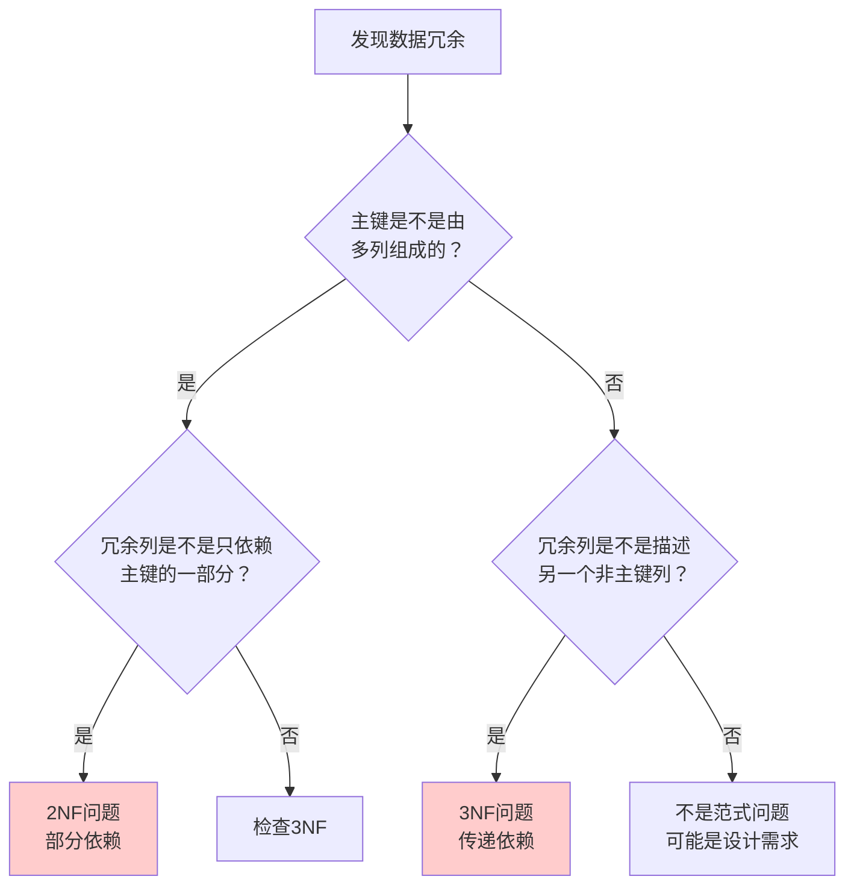

# 第二章：数据库设计与规范化

本章将介绍如何设计一个结构良好的数据库。你将学习数据库规范化的基本原则、SQLite 的数据类型系统，以及各种约束的使用方法。良好的数据库设计能够避免数据冗余、保证数据完整性，为后续的查询操作奠定坚实基础。

## 1. 为什么需要良好的数据库设计

### 1.1 糟糕设计的代价

假设我们要设计一个学生选课系统，下面是一个**糟糕的设计**：

```
┌────┬───────────┬──────────┬─────────────┬─────────────┬──────────┬──────────────────┐
│ ID │ Student   │ Course   │ Professor   │ Dept        │ Score    │ Email            │
├────┼───────────┼──────────┼─────────────┼─────────────┼──────────┼──────────────────┤
│ 1  │ Alice     │ Math     │ Prof. Wang  │ Math Dept   │ 85       │ alice@ex.com     │
│ 2  │ Alice     │ Physics  │ Prof. Li    │ Physics Dept│ 90       │ alice@ex.com     │ ← 学生信息重复
│ 3  │ Bob       │ Math     │ Prof. Wang  │ Math Dept   │ 78       │ bob@ex.com       │
│ 4  │ Bob       │ Chemistry│ Prof. Zhao  │ Chemistry   │ 82       │ bob@ex.com       │ ← 邮箱重复存储
└────┴───────────┴──────────┴─────────────┴─────────────┴──────────┴──────────────────┘
```

**这种设计的问题：**

| 问题         | 说明                                     |
| ------------ | ---------------------------------------- |
| **数据冗余** | 学生姓名、邮箱重复存储；教授和系信息重复 |
| **更新异常** | 张三换邮箱需要修改多行，容易遗漏         |
| **插入异常** | 新开课程没有学生选课时，学生列只能留空   |
| **删除异常** | 删除所有选课记录，教授信息也随之丢失     |

### 1.2 良好设计的特征

一个设计良好的数据库应该具备：

1. **数据完整性** —— 准确、一致、可靠的数据
2. **最小冗余** —— 每份数据只存储一次
3. **灵活性** —— 容易适应需求变化
4. **性能合理** —— 查询效率可接受

## 2. 数据库规范化：让表设计更合理

想象一下你搬家时打包行李：如果把衣服、鞋子、书籍全都塞进一个箱子，虽然"装得下"，但找东西会很麻烦，而且同样的物品可能在多个箱子里重复出现。数据库规范化就像是给数据"分类打包"，让每个信息都放在最合适的地方。

### 2.1 第一范式（1NF）：一格一格，各不相干

**核心思想：每个单元格只存一个值，不能是"一袋子东西"**

❌ **不好的做法**——把多个课程塞进一个格子：

```
│ Student │ Courses                │
│ Alice   │ Math, Physics, Chem    │ ← 一个格子塞了三门课，像把三双鞋装进一个鞋盒
```

这样做有什么问题？

- 想查"哪些学生选了 Physics"？不好查
- 想删掉 Alice 的 Math 课？要修改整个字符串

✅ **好的做法**——每行只存一条记录：

```
│ Student │ Course     │
│ Alice   │ Math       │
│ Alice   │ Physics    │
│ Alice   │ Chemistry  │
```

**一句话记住 1NF**：一格一格，各不相干；一个萝卜，一个坑。

---

### 2.2 第二范式（2NF）：找准"归属"，别乱放

**核心思想：每个信息都应该放在"它该在的地方"**

假设我们有一个成绩单，主键是「学生 + 课程」的组合：

❌ **不好的做法**——把课程信息和学生成绩混在一起：

```
│ Student │ Course   │ Score │ Professor    │ Department     │
├─────────┼──────────┼───────┼──────────────┼────────────────┤
│ Alice   │ Math     │ 85    │ Prof. Wang   │ Math Dept      │
│ Bob     │ Math     │ 90    │ Prof. Wang   │ Math Dept      │ ← 教师信息重复了！
│ Carol   │ Math     │ 78    │ Prof. Wang   │ Math Dept      │ ← 院系信息也重复了！
```

**发现问题了吗？**

- Wang 老师是教 Math 的，不管谁来学都是 Wang 老师教
- 但上面的表里，Wang 老师的信息被重复存储了很多次
- 如果 Wang 老师调到了别的院系，要改好多行！

**这就像什么？**

> 就像每次学生选课，你都把"课程说明书"复印一份贴在成绩单上。其实只需要一份说明书，大家共享就行了。

✅ **好的做法**——拆成两个表：

```
【选课成绩表】——只存"谁选了什么课，考了多少分"
│ Student │ Course   │ Score │
├─────────┼──────────┼───────┤
│ Alice   │ Math     │ 85    │
│ Bob     │ Math     │ 90    │
│ Carol   │ Math     │ 78    │

【课程信息表】——只存"课程是谁教的，哪个院系"
│ Course   │ Professor    │ Department     │
├──────────┼──────────────┼────────────────┤
│ Math     │ Prof. Wang   │ Math Dept      │ ← 只存一份！
│ Physics  │ Prof. Li     │ Physics Dept   │
```

**一句话记住 2NF**：找准归属，别乱放；共享信息，单独存。

---

### 2.3 第三范式（3NF）：斩断"传话筒"

**核心思想：信息之间不能"传话"，必须直接关联主键**

继续上面的例子，假设课程表变成了这样：

❌ **不好的做法**——信息之间有了"传话链"：

```
【课程信息表】
│ Course   │ Professor    │ Department     │ Dept_Location      │
├──────────┼──────────────┼────────────────┼────────────────────┤
│ Math     │ Prof. Wang   │ Math Dept      │ Science Bldg A     │
│ Physics  │ Prof. Li     │ Physics Dept   │ Science Bldg B     │
```

**问题在哪？**

- 院系地址其实和"课程"没有直接关系
- 院系地址 → 依赖于 → 开课院系 → 依赖于 → 课程
- 这就像传话游戏：课程→院系→地址，中间多了一层

**如果 Math Dept 搬家了？** 你要改所有 Math Dept 的课程记录。

✅ **好的做法**——再拆一层，彻底斩断传话链：

```
【课程信息表】——课程直接相关的信息
│ Course   │ Professor    │ Dept_ID │
├──────────┼──────────────┼─────────┤
│ Math     │ Prof. Wang   │ 1       │
│ Physics  │ Prof. Li     │ 2       │

【院系信息表】——院系相关的信息单独存
│ Dept_ID │ Dept_Name      │ Dept_Location      │
├─────────┼────────────────┼────────────────────┤
│ 1       │ Math Dept      │ Science Bldg A     │ ← 院系地址只存这里！
│ 2       │ Physics Dept   │ Science Bldg B     │
```

**现在的好处：**

- Math Dept 搬家？只需要改【院系信息表】的一行
- 新开一门 Math 系的课？不需要重复填写院系地址

**一句话记住 3NF**：斩断传话，直接关联；各就其位，互不打搅。

---

### 2.4 2NF vs 3NF：如何区分？

很多初学者觉得 2NF 和 3NF 很像，因为它们都涉及**拆表消除冗余**。但它们的本质问题是完全不同的：

#### 🔍 核心区别：看"冗余信息"是怎么产生的

| 对比点       | 第二范式（2NF）                    | 第三范式（3NF）                    |
| ------------ | ---------------------------------- | ---------------------------------- |
| **问题本质** | 同一类信息在**多行重复**           | 信息通过**中间人间接关联**         |
| **依赖类型** | **部分依赖** —— 只依赖主键的一部分 | **传递依赖** —— A→B→C 的链条       |
| **出现条件** | 主键由**多个列**组成时才可能出现   | 任何表都可能出现，与主键形式无关   |
| **判断口诀** | "这个信息是不是对所有人都一样？"   | "这个信息是不是描述另一个信息的？" |
| **拆表思路** | 把**共享的**信息抽出去             | 把**描述别人的**信息抽出去         |

#### 🌰 用同一个例子，看两种问题如何分别出现

假设有一个**选课成绩表**，主键是 `(Student, Course)`：

**第一步：检查 2NF —— 有没有"部分依赖"？**

```
│ Student │ Course  │ Score │ Professor  │ Department  │
├─────────┼─────────┼───────┼────────────┼─────────────┤
│ Alice   │ Math    │ 85    │ Prof.Wang  │ Math Dept   │
│ Bob     │ Math    │ 90    │ Prof.Wang  │ Math Dept   │  ← Wang老师重复了！
│ Carol   │ Math    │ 78    │ Prof.Wang  │ Math Dept   │  ← 院系也重复了！
```

❌ **发现 2NF 问题**：

- 主键是 `(Student, Course)` 两列
- 但 `Professor` 只依赖于 `Course`，和 `Student` 无关
- 这就叫**部分依赖** —— 只依赖主键的一部分
- 后果：同一门课选的人越多，教师信息重复越多

✅ **2NF 解决方案** —— 拆出"课程信息表"：

```
【选课成绩表】              【课程信息表】
│ Student │ Course │ Score │  │ Course │ Professor │ Department │
├─────────┼────────┼───────┤  ├────────┼───────────┼────────────┤
│ Alice   │ Math   │ 85    │  │ Math   │ Prof.Wang │ Math Dept  │
│ Bob     │ Math   │ 90    │  └────────┴───────────┴────────────┘
│ Carol   │ Math   │ 78    │      ↑ 一门课只存一份教师信息
└─────────┴────────┴───────┘
```

**第二步：检查 3NF —— 有没有"传递依赖"？**

上面的表拆完了，现在看**课程信息表**，主键是 `Course`：

```
【课程信息表】
│ Course │ Professor  │ Department  │ Dept_Location     │ Dept_Phone  │
├────────┼────────────┼─────────────┼───────────────────┼─────────────┤
│ Math   │ Prof.Wang  │ Math Dept   │ Science Bldg A    │ 1234-5678   │
│ Physics│ Prof.Li    │ Physics Dept│ Science Bldg B    │ 8765-4321   │
```

❌ **发现 3NF 问题**：

- 主键只有一列 `Course`，满足 2NF（不存在部分依赖）
- 但是！`Dept_Location` 其实描述的是 `Department`，不是直接描述 `Course`
- 依赖链条：`Course` → `Department` → `Dept_Location`
- 这就叫**传递依赖** —— 像传话游戏一样隔了一层
- 后果：同一个院系的多门课，地址信息会重复

✅ **3NF 解决方案** —— 再拆出"院系信息表"：

```
【课程信息表】                    【院系信息表】
│ Course │ Professor │ Dept_ID │  │ Dept_ID │ Dept_Name    │ Dept_Location   │
├────────┼───────────┼─────────┤  ├─────────┼──────────────┼─────────────────┤
│ Math   │ Prof.Wang │ 1       │  │ 1       │ Math Dept    │ Science Bldg A  │
│ Physics│ Prof.Li   │ 2       │  │ 2       │ Physics Dept │ Science Bldg B  │
└────────┴───────────┴─────────┘  └─────────┴──────────────┴─────────────────┘
            ↑ 用ID关联，不直接存院系详情          ↑ 院系信息只存一份
```

#### 🎯 快速判断流程图

当你发现表中有冗余数据时，按这个顺序判断：



#### 📊 一句话总结区别

| 范式    | 问自己的关键问题                                             |
| ------- | ------------------------------------------------------------ |
| **2NF** | "这个信息是不是不管谁来用都一样的？"（如：课程的老师）       |
| **3NF** | "这个信息是不是在描述另一个信息的？"（如：院系地址描述院系） |

> 💡 **记忆技巧**
>
> - **2NF** 解决的是 "**一对多中的'一'被重复存储**" 的问题
>   - 一门课 → 多个学生选 → 课程信息重复
> - **3NF** 解决的是 "**隔代遗传**" 的问题
>   - 课程 → 属于院系 → 院系有地址
>   - 课程不应该"隔代"知道地址，应该只直接知道院系

---

### 2.5 规范化三步走：一张图看懂

让我们用一个图书馆的例子来总结：

**初始的"大杂烩"表（什么都不满足）：**

```
│ Reader │ Book_Title              │ Author       │ Category   │ Category_Location │ Borrow_Date │
├────────┼─────────────────────────┼──────────────┼────────────┼───────────────────┼─────────────┤
│ Alice  │ Three-Body, Wandering   │ Liu Cixin    │ Sci-Fi     │ Floor 2, Area B   │ 2024-01-15  │
│        │ Earth                   │              │            │                   │             │
│        │                         │              │            │                   │             │
│ ↑ 一个人借了多本书，违反 1NF                          ↑ 分类位置其实只和分类有关，违反 3NF
```

**规范化后的结构：**

```
【借阅记录表】          【图书信息表】                【分类信息表】
│ Reader │ Book_ID │ Date │  │ Book_ID │ Title            │ Author     │ Cat_ID │  │ Cat_ID │ Name    │ Location        │
├────────┼─────────┼──────┤  ├─────────┼──────────────────┼────────────┼────────┤  ├────────┼─────────┼─────────────────┤
│ Alice  │ 1       │ ...  │  │ 1       │ Three-Body       │ Liu Cixin  │ 10     │  │ 10     │ Sci-Fi  │ Floor 2, Area B │
│ Alice  │ 2       │ ...  │  │ 2       │ Wandering Earth  │ Liu Cixin  │ 10     │  │ 20     │ Fiction │ Floor 2, Area C │
│ Bob    │ 1       │ ...  │  │ 3       │ Dream of Red     │ Cao Xueqin │ 20     │  └────────┴─────────┴─────────────────┘
└────────┴─────────┴──────┘  └─────────┴──────────────────┴────────────┴────────┘
         ↑                           ↑                           ↑
        1NF：一格一值               2NF：图书信息独立              3NF：分类信息独立
```

---

### 2.6 规范化速查表

| 范式    | 检查口诀   | 解决的问题           | 类比生活                       |
| ------- | ---------- | -------------------- | ------------------------------ |
| **1NF** | 一格一个值 | 防止"一袋子装多个"   | 一个鞋盒放一双鞋               |
| **2NF** | 找准归属地 | 防止重复存储共享信息 | 课程说明书只印一份             |
| **3NF** | 斩断传话筒 | 防止间接依赖         | 地址写在通讯录，别写在成绩单上 |

> **📌 给新手的建议**
>
> 1. **先别追求完美**：刚开始设计时，满足 3NF 就已经很好了
> 2. **从问题出发**：如果发现改一个地方要改很多地方，就该考虑拆表了
> 3. **别过度拆分**：表太多会增加查询复杂度，有时候适当的冗余反而更好
> 4. **记住核心目标**：减少重复数据，让修改更容易

## 3. 创建表：CREATE TABLE 基础

在深入了解数据类型和约束之前，让我们先掌握创建表的基本语法。

### 3.1 基本语法结构

`CREATE TABLE` 语句用于在数据库中创建新表，其基本结构如下：

```sql
CREATE TABLE table_name (
    column1_name datatype [constraints],
    column2_name datatype [constraints],
    column3_name datatype [constraints],
    ...
    [, table_constraints]
);
```

**各部分的含义：**

| 部分          | 说明                     | 示例                      |
| ------------- | ------------------------ | ------------------------- |
| `table_name`  | 表的名字，需唯一且有意义 | `students`, `orders`      |
| `column_name` | 列（字段）的名字         | `id`, `name`, `email`     |
| `datatype`    | 该列存储的数据类型       | `INTEGER`, `TEXT`, `REAL` |
| `constraints` | 可选的约束条件           | `NOT NULL`, `PRIMARY KEY` |

### 3.2 第一个建表示例

让我们创建一个简单的学生表：

```sql
CREATE TABLE students (
    id          INTEGER PRIMARY KEY,    -- 学号，主键
    name        TEXT NOT NULL,          -- 姓名，不能为空
    age         INTEGER,                -- 年龄
    email       TEXT UNIQUE,            -- 邮箱，必须唯一
    created_at  TEXT DEFAULT CURRENT_TIMESTAMP  -- 创建时间，默认当前时间
);
```

**逐步解析：**

1. **`id INTEGER PRIMARY KEY`**
   - 定义了一个名为 `id` 的整数列
   - `PRIMARY KEY` 表示这是主键，唯一标识每行记录
   - 在 SQLite 中，`INTEGER PRIMARY KEY` 还会自动递增

2. **`name TEXT NOT NULL`**
   - 定义了一个名为 `name` 的文本列
   - `NOT NULL` 约束确保该列不能存储空值

3. **`age INTEGER`**
   - 定义了一个名为 `age` 的整数列
   - 没有额外约束，可以为空

4. **`email TEXT UNIQUE`**
   - 定义了一个名为 `email` 的文本列
   - `UNIQUE` 约束确保邮箱地址不重复

5. **`created_at TEXT DEFAULT CURRENT_TIMESTAMP`**
   - 定义了一个名为 `created_at` 的文本列
   - `DEFAULT` 设置默认值，插入数据时如未指定则自动填入当前时间

### 3.3 创建表的完整流程

在实际操作中，创建表通常遵循以下步骤：

```sql
-- 步骤 1：如果表已存在，先删除（可选，开发阶段常用）
DROP TABLE IF EXISTS students;

-- 步骤 2：创建新表
CREATE TABLE students (
    id          INTEGER PRIMARY KEY,
    name        TEXT NOT NULL,
    age         INTEGER CHECK(age >= 0 AND age <= 150),
    email       TEXT UNIQUE,
    major       TEXT DEFAULT 'Undecided',
    created_at  TEXT DEFAULT CURRENT_TIMESTAMP
);

-- 步骤 3：验证表结构（SQLite 专用命令）
.schema students
```

### 3.4 表级约束 vs 列级约束

约束可以在两个级别定义：

**列级约束** —— 紧跟在列定义后：

```sql
CREATE TABLE example1 (
    id      INTEGER PRIMARY KEY,     -- 列级约束
    name    TEXT NOT NULL,           -- 列级约束
    email   TEXT UNIQUE              -- 列级约束
);
```

**表级约束** —— 在所有列定义之后：

```sql
CREATE TABLE example2 (
    id      INTEGER,
    name    TEXT,
    email   TEXT,
    PRIMARY KEY (id),                -- 表级约束
    UNIQUE (email)                   -- 表级约束
);
```

**什么时候必须用表级约束？**

- **复合主键**（多列联合作为主键）
- **涉及多列的约束**（如联合唯一约束）

```sql
-- 复合主键必须用表级约束
CREATE TABLE course_selections (
    student_id  INTEGER,
    course_id   INTEGER,
    score       INTEGER,
    PRIMARY KEY (student_id, course_id),  -- 联合主键
    CHECK (score >= 0 AND score <= 100)   -- 成绩范围检查
);
```

### 3.5 命名规范建议

良好的命名习惯能让数据库更易维护：

| 对象     | 推荐规范                   | 示例                                      |
| -------- | -------------------------- | ----------------------------------------- |
| **表名** | 小写，复数形式，下划线分隔 | `students`, `order_items`                 |
| **列名** | 小写，下划线分隔           | `created_at`, `user_id`                   |
| **主键** | 通常用 `id` 或 `表名_id`   | `id`, `student_id`                        |
| **外键** | 引用表名 + `_id`           | `department_id` 引用 `departments`        |

> **📌 记住**
>
> - 表创建后，列名和数据类型理论上可以修改，但在生产环境尽量避免
> - 设计表结构时，先画草图明确需要哪些列、什么类型、什么约束
> - 好的表设计是查询性能的基础，花时间在设计阶段是值得的

## 4. SQLite 数据类型

### 4.1 存储类别（Storage Classes）

SQLite 使用**动态类型**，定义了五种存储类别：

| 存储类别  | 说明                | 示例                 |
| --------- | ------------------- | -------------------- |
| `NULL`    | 空值                | -                    |
| `INTEGER` | 整型，1-8 字节      | 1, -42, 1000000      |
| `REAL`    | 浮点数，8 字节 IEEE | 3.14, -0.001, 1.0e10 |
| `TEXT`    | 文本字符串          | 'Hello', '中文'      |
| `BLOB`    | 二进制数据          | 图片、文件内容       |

### 4.2 类型亲和性（Type Affinity）

SQLite 的一大特点是**类型亲和性（Type Affinity）**：列有"倾向"的类型，但插入数据时会尝试自动转换。

**创建表时声明的类型会被映射到亲和性：**

| 声明的类型包含         | 亲和性  | 说明                     |
| ---------------------- | ------- | ------------------------ |
| `INT`                  | INTEGER | 整数                     |
| `CHAR`, `TEXT`, `CLOB` | TEXT    | 文本                     |
| `BLOB`                 | NONE    | 无亲和性，原样存储       |
| `REAL`, `FLOA`, `DOUB` | REAL    | 浮点数                   |
| 其他                   | NUMERIC | 数值（根据输入自动选择） |

**类型转换示例：**

```sql
CREATE TABLE test (
    num_column INTEGER,  -- 整数亲和性
    text_column TEXT     -- 文本亲和性
);

-- 尽管声明为 INTEGER，但可以插入 TEXT
INSERT INTO test VALUES ('123', 456);

-- 查询时，'123' 会被转换为整数 123
SELECT num_column + 1 FROM test;  -- 结果是 124
```

> **📌 SQLite 与其他数据库的区别**
>
> | 特性                 | SQLite           | MySQL/PostgreSQL   |
> | -------------------- | ---------------- | ------------------ |
> | 类型系统             | 动态类型，亲和性 | 静态类型，严格检查 |
> | 插入 'abc' 到 INT 列 | 允许（原样存储） | 报错或截断         |
> | 长度限制             | 不严格执行       | 严格执行           |
>
> SQLite 的灵活性适合原型开发和嵌入式场景，生产环境建议显式控制数据类型。

### 4.3 选择合适的数据类型

```sql
-- 创建学生表，展示类型选择
CREATE TABLE students (
    id INTEGER PRIMARY KEY,        -- 主键，自增整数
    name TEXT NOT NULL,            -- 姓名，文本
    age INTEGER CHECK(age > 0),    -- 年龄，正整数
    gpa REAL,                      -- 绩点，浮点数
    photo BLOB,                    -- 照片，二进制
    created_at TEXT                -- 时间，建议用 TEXT 存 ISO 8601 格式
);
```

**类型选择建议：**

| 数据       | 推荐类型                                     | 说明                             |
| ---------- | -------------------------------------------- | -------------------------------- |
| ID、计数   | `INTEGER`                                    | 效率高，自动递增                 |
| 姓名、描述 | `TEXT`                                       | 可变长度，支持 Unicode           |
| 价格、分数 | `REAL` 或 `INTEGER`                          | 金额建议用分存储（避免浮点误差） |
| 日期时间   | `TEXT` (ISO 8601) 或 `INTEGER` (Unix 时间戳) | SQLite 无专门日期类型            |
| 图片、文件 | `BLOB`                                       | 但大文件建议存路径而非内容       |

## 5. 约束（Constraints）

约束用于限制表中数据的规则，保证数据的完整性和一致性。

### 5.1 列级约束

直接在列定义后声明。

#### 5.1.1 NOT NULL —— 非空约束

```sql
CREATE TABLE users (
    id INTEGER PRIMARY KEY,
    username TEXT NOT NULL,  -- 用户名不能为空
    email TEXT NOT NULL      -- 邮箱不能为空
);

-- 错误：会报错
INSERT INTO users (id, username) VALUES (1, 'Alice');
-- 错误：email 为 NULL
```

#### 5.1.2 DEFAULT —— 默认值

```sql
CREATE TABLE orders (
    id INTEGER PRIMARY KEY,
    quantity INTEGER DEFAULT 1,        -- 默认数量为 1
    status TEXT DEFAULT 'pending',     -- 默认状态为待处理
    created_at TEXT DEFAULT CURRENT_TIMESTAMP  -- 默认当前时间
);

-- 只提供 id，其他使用默认值
INSERT INTO orders (id) VALUES (1);
-- 结果：quantity=1, status='pending', created_at=当前时间
```

#### 5.1.3 UNIQUE —— 唯一约束

```sql
CREATE TABLE users (
    id INTEGER PRIMARY KEY,
    email TEXT UNIQUE,  -- 邮箱必须唯一
    phone TEXT UNIQUE   -- 手机号也必须唯一
);

-- 错误：重复邮箱
INSERT INTO users VALUES (1, 'alice@example.com', '123');
INSERT INTO users VALUES (2, 'alice@example.com', '456');  -- 报错！
```

#### 5.1.4 CHECK —— 检查约束

```sql
CREATE TABLE products (
    id INTEGER PRIMARY KEY,
    name TEXT NOT NULL,
    price REAL CHECK(price > 0),           -- 价格必须大于 0
    stock INTEGER CHECK(stock >= 0),       -- 库存不能为负
    category TEXT CHECK(category IN ('A', 'B', 'C'))  -- 只能是特定值
);

-- 错误：价格为负数
INSERT INTO products VALUES (1, 'Widget', -10, 100, 'A');  -- 报错！
```

### 5.2 表级约束

在列定义之后单独声明，可以涉及多列。

#### 5.2.1 PRIMARY KEY —— 主键

```sql
-- 单列主键（列级约束写法）
CREATE TABLE students (
    id INTEGER PRIMARY KEY,
    name TEXT
);

-- 单列主键（表级约束写法）
CREATE TABLE students (
    id INTEGER,
    name TEXT,
    PRIMARY KEY (id)
);

-- 复合主键（必须用表级约束）
CREATE TABLE course_selections (
    student_id INTEGER,
    course_id INTEGER,
    score INTEGER,
    PRIMARY KEY (student_id, course_id)  -- 学生+课程联合唯一
);
```

#### 5.2.2 FOREIGN KEY —— 外键

建立表之间的关系，保证引用完整性。

```sql
-- 系表
CREATE TABLE departments (
    id INTEGER PRIMARY KEY,
    name TEXT NOT NULL
);

-- 学生表，引用系表
CREATE TABLE students (
    id INTEGER PRIMARY KEY,
    name TEXT NOT NULL,
    dept_id INTEGER,
    FOREIGN KEY (dept_id) REFERENCES departments(id)
        ON DELETE SET NULL     -- 系被删除，学生 dept_id 设为 NULL
        ON UPDATE CASCADE      -- 系 id 更新，学生 dept_id 同步更新
);
```

**外键的级联操作：**

| 操作                 | 说明                             |
| -------------------- | -------------------------------- |
| `ON DELETE CASCADE`  | 父表记录删除，子表关联记录也删除 |
| `ON DELETE SET NULL` | 父表记录删除，子表外键设为 NULL  |
| `ON DELETE RESTRICT` | 有子表引用时，禁止删除父表记录   |
| `ON UPDATE CASCADE`  | 父表主键更新，子表外键同步更新   |

### 5.3 约束总结

```sql
-- 综合示例：设计一个电商订单系统

-- 用户表
CREATE TABLE users (
    id INTEGER PRIMARY KEY,
    username TEXT NOT NULL,
    email TEXT NOT NULL UNIQUE,
    created_at TEXT DEFAULT CURRENT_TIMESTAMP
);

-- 商品表
CREATE TABLE products (
    id INTEGER PRIMARY KEY,
    name TEXT NOT NULL,
    price INTEGER NOT NULL CHECK(price > 0),  -- 分为单位，避免浮点
    stock INTEGER NOT NULL DEFAULT 0 CHECK(stock >= 0)
);

-- 订单表
CREATE TABLE orders (
    id INTEGER PRIMARY KEY,
    user_id INTEGER NOT NULL,
    total_amount INTEGER CHECK(total_amount >= 0),
    status TEXT DEFAULT 'pending' CHECK(status IN ('pending', 'paid', 'shipped', 'cancelled')),
    created_at TEXT DEFAULT CURRENT_TIMESTAMP,
    FOREIGN KEY (user_id) REFERENCES users(id)
);

-- 订单详情表
CREATE TABLE order_items (
    order_id INTEGER,
    product_id INTEGER,
    quantity INTEGER NOT NULL CHECK(quantity > 0),
    unit_price INTEGER NOT NULL,
    PRIMARY KEY (order_id, product_id),
    FOREIGN KEY (order_id) REFERENCES orders(id) ON DELETE CASCADE,
    FOREIGN KEY (product_id) REFERENCES products(id)
);
```

| 约束类型      | 级别    | 作用               |
| ------------- | ------- | ------------------ |
| `NOT NULL`    | 列级    | 禁止 NULL 值       |
| `DEFAULT`     | 列级    | 设置默认值         |
| `UNIQUE`      | 列/表级 | 保证唯一性         |
| `CHECK`       | 列/表级 | 自定义验证条件     |
| `PRIMARY KEY` | 表级    | 唯一标识每行       |
| `FOREIGN KEY` | 表级    | 维护表间引用完整性 |

## 6. 修改表结构

表创建后，可以使用 `ALTER TABLE` 修改结构。

### 6.1 重命名表

```sql
ALTER TABLE old_name RENAME TO new_name;

-- 示例
ALTER TABLE students RENAME TO pupils;
```

### 6.2 添加列

```sql
ALTER TABLE table_name ADD COLUMN column_name datatype constraints;

-- 示例：给学生表添加邮箱列
ALTER TABLE students ADD COLUMN email TEXT UNIQUE;

-- 添加 NOT NULL 列必须提供默认值
ALTER TABLE students ADD COLUMN age INTEGER NOT NULL DEFAULT 18;
```

> **SQLite 的限制**：不能通过 ALTER TABLE 删除列或修改列类型。需要：
>
> 1. 创建新表
> 2. 复制数据
> 3. 删除旧表
> 4. 重命名新表

### 6.3 删除表

```sql
DROP TABLE table_name;

-- 示例
DROP TABLE temp_data;

-- 如果表不存在不报错
DROP TABLE IF EXISTS temp_data;
```

## 7. 完整示例：设计一个图书馆系统

```sql
-- 1. 删除旧表（如果存在）
DROP TABLE IF EXISTS borrow_records;
DROP TABLE IF EXISTS books;
DROP TABLE IF EXISTS readers;
DROP TABLE IF EXISTS categories;

-- 2. 分类表
CREATE TABLE categories (
    id INTEGER PRIMARY KEY,
    name TEXT NOT NULL UNIQUE,
    location TEXT  -- 存放位置
);

-- 3. 读者表
CREATE TABLE readers (
    id INTEGER PRIMARY KEY,
    name TEXT NOT NULL,
    phone TEXT UNIQUE,
    email TEXT,
    max_books INTEGER DEFAULT 5 CHECK(max_books > 0),
    created_at TEXT DEFAULT CURRENT_TIMESTAMP
);

-- 4. 图书表
CREATE TABLE books (
    id INTEGER PRIMARY KEY,
    isbn TEXT UNIQUE,
    title TEXT NOT NULL,
    author TEXT NOT NULL,
    publisher TEXT,
    publish_year INTEGER CHECK(publish_year > 1900 AND publish_year <= 2100),
    category_id INTEGER,
    total_copies INTEGER DEFAULT 1 CHECK(total_copies >= 0),
    available_copies INTEGER DEFAULT 1 CHECK(available_copies >= 0 AND available_copies <= total_copies),
    FOREIGN KEY (category_id) REFERENCES categories(id)
        ON DELETE SET NULL
        ON UPDATE CASCADE
);

-- 5. 借阅记录表
CREATE TABLE borrow_records (
    id INTEGER PRIMARY KEY,
    book_id INTEGER NOT NULL,
    reader_id INTEGER NOT NULL,
    borrow_date TEXT DEFAULT CURRENT_TIMESTAMP,
    due_date TEXT NOT NULL,
    return_date TEXT,
    status TEXT DEFAULT 'borrowed' CHECK(status IN ('borrowed', 'returned', 'overdue')),
    FOREIGN KEY (book_id) REFERENCES books(id),
    FOREIGN KEY (reader_id) REFERENCES readers(id),
    -- 同一本书同一时间只能被一个读者借走
    UNIQUE(book_id, status) WHERE status = 'borrowed'
);

-- 6. 插入示例数据
INSERT INTO categories (id, name, location) VALUES
(1, 'Computer Science', 'Floor 3, Section A'),
(2, 'Literature', 'Floor 2, Section B'),
(3, 'History', 'Floor 2, Section C');

INSERT INTO readers (id, name, phone, email) VALUES
(1, 'Alice', '13800138000', 'alice@example.com'),
(2, 'Bob', '13800138001', 'bob@example.com'),
(3, 'Carol', '13800138002', 'carol@example.com');

INSERT INTO books (id, isbn, title, author, publisher, publish_year, category_id, total_copies, available_copies) VALUES
(1, '978-7-111-1', 'Database System Concepts', 'Silberschatz', 'McGraw-Hill', 2020, 1, 3, 2),
(2, '978-7-111-2', 'The Three-Body Problem', 'Liu Cixin', 'Chongqing Press', 2008, 2, 5, 3),
(3, '978-7-111-3', 'Sapiens: A Brief History of Humankind', 'Harari', 'CITIC Press', 2014, 3, 2, 1);

INSERT INTO borrow_records (id, book_id, reader_id, due_date) VALUES
(1, 1, 1, '2024-03-15'),
(2, 2, 1, '2024-03-15');
```

## 8. 本章小结

### 核心概念回顾

| 概念            | 一句话理解                                             |
| --------------- | ------------------------------------------------------ |
| **规范化**      | 通过拆分表消除冗余和异常的系统性方法                   |
| **1NF**         | 列值原子性，不可再分                                   |
| **2NF**         | 消除部分依赖，非主键列依赖整个主键                     |
| **3NF**         | 消除传递依赖，非主键列只依赖主键                       |
| **存储类别**    | SQLite 的五种数据类型：NULL、INTEGER、REAL、TEXT、BLOB |
| **类型亲和性**  | SQLite 尝试将数据转换为列倾向的类型                    |
| **NOT NULL**    | 禁止列值为空                                           |
| **DEFAULT**     | 设置默认值                                             |
| **UNIQUE**      | 保证列值唯一                                           |
| **CHECK**       | 自定义数据验证条件                                     |
| **PRIMARY KEY** | 唯一标识每行记录                                       |
| **FOREIGN KEY** | 建立表间关系，维护引用完整性                           |
| **ALTER TABLE** | 修改表结构（重命名、添加列）                           |

### 设计 checklist

设计新表时，逐条检查：

- [ ] 是否满足 3NF？（数据冗余最小化）
- [ ] 每列是否选择了合适的类型？
- [ ] 主键是否明确？
- [ ] 外键关系是否正确建立？
- [ ] 是否添加了必要的约束（NOT NULL、UNIQUE、CHECK）？
- [ ] 默认值设置是否合理？

### 学习路径预告

下一章将学习 **SQL 基础查询**，我们将在本章设计的表上进行各种查询操作。
