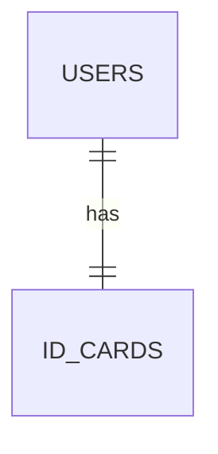
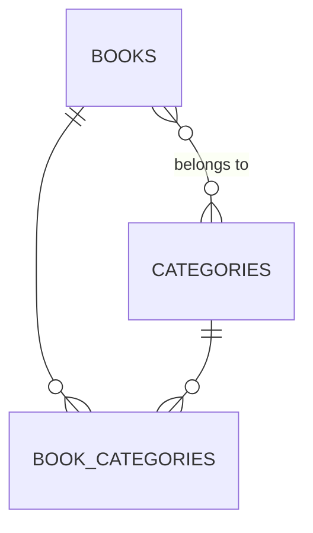
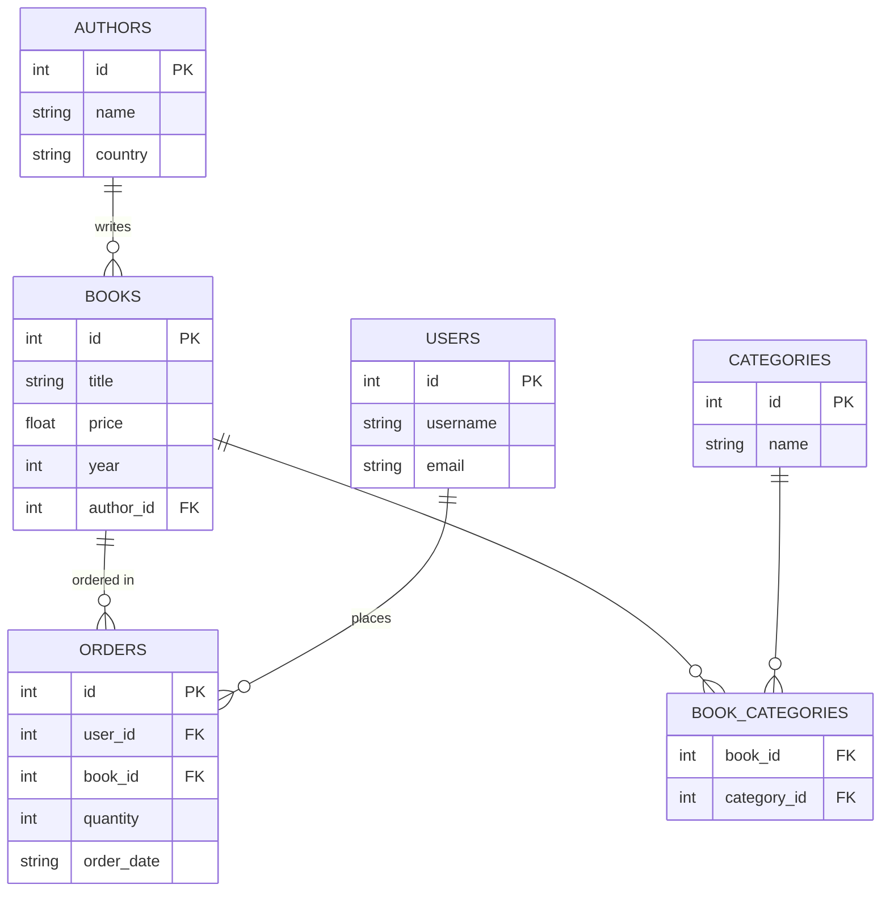

# 第四章：数据库关系设计

本章将介绍关系型数据库的核心理念——通过表与表之间的关系来组织数据。你将学习实体关系（ER）模型、主键与外键的概念，以及如何通过 JOIN 查询组合多个表的数据。通过本章学习，你将能够设计简单的多表数据库结构，并掌握跨表查询的技能。

## 1. 为什么需要多表设计

在第三章中，我们所有的查询都在单个 `books` 表上进行。但在真实的在线书店系统中，数据远比这复杂：

- **书籍信息**：书名、作者、价格、分类
- **作者信息**：姓名、国籍、简介
- **用户信息**：用户名、邮箱、地址
- **订单信息**：谁、什么时候、买了什么书

### 1.1 单表设计的问题

假设我们把所有信息都放在一张大表中：

```
┌────┬─────────────┬──────────┬────────────┬─────────────┬──────────────┬──────────┐
│ ID │ Book Title  │ Author   │ User Name  │ User Email  │ Order Date   │ Quantity │
├────┼─────────────┼──────────┼────────────┼─────────────┼──────────────┼──────────┤
│ 1  │ SQL Intro   │ Zhang    │ User A     │ a@qq.com    │ 2024-01-15   │ 2        │
│ 2  │ SQL Intro   │ Zhang    │ User B     │ b@qq.com    │ 2024-01-16   │ 1        │ ← Book info repeated
│ 3  │ Python      │ Li       │ User A     │ a@qq.com    │ 2024-01-20   │ 1        │ ← User info repeated
└────┴─────────────┴──────────┴────────────┴─────────────┴──────────────┴──────────┘
```

**单表设计的问题：**

1. **数据冗余**：同一本书的信息重复存储，浪费空间
2. **更新异常**：修改作者信息需要更新多行，容易遗漏导致不一致
3. **删除异常**：如果删除所有订单，书籍信息也随之消失
4. **插入异常**：新书籍没有订单时，用户信息列只能留空

### 1.2 多表设计的优势

将数据拆分到不同的表中，通过**关系**连接：

```
┌─────────────────────┐    ┌─────────────────────┐    ┌───────────────────-──┐
│       books         │    │       users         │    │      orders          │
├────┬───────────┬────┤    ├────┬───────────┬────┤    ├────┬────────┬────────┤
│ ID │ Title     │ ...│    │ ID │ Name      │ ...│    │ ID │ BookID │ UserID │
├────┼───────────┼────┤    ├────┼───────────┼────┤    ├────┼────────┼────────┤
│ 1  │ SQL Intro │ ...│    │ 1  │ Alice     │ ...│    │ 1  │ 1      │ 1      │
│ 2  │ Python    │ ...│    │ 2  │ Bob       │ ...│    │ 2  │ 1      │ 2      │
└────┴───────────┴────┘    └────┴───────────┴────┘    │ 3  │ 2      │ 1      │
                                                      └────┴────────┴────────┘
```

通过 `orders` 表中的 `BookID` 和 `UserID`，我们可以关联到对应的书籍和用户信息，避免了数据冗余。

## 2. 实体关系（ER）模型

**ER 模型（Entity-Relationship Model）** 是设计数据库的常用方法，它帮助我们可视化地描述数据结构。

### 2.1 实体（Entity）

**实体**是现实世界中可区分的事物，在数据库中对应**表（Table）**。

- **书籍**是一个实体 → 对应 `books` 表
- **用户**是一个实体 → 对应 `users` 表
- **订单**是一个实体 → 对应 `orders` 表

每个实体都有**属性（Attributes）**，对应表中的列：

| Entity | Attributes (Columns)                     |
| ------ | ---------------------------------------- |
| Book   | ID, Title, Author, Price, Year           |
| User   | ID, Username, Email, Register Time       |
| Order  | ID, BookID, UserID, Quantity, Order Date |

### 2.2 关系类型

实体之间的关系有三种基本类型：

#### 一对一（1:1）

一个实体实例对应另一个实体的一个实例。

**示例**：用户与身份证

- 一个用户对应一张身份证
- 一张身份证对应一个用户



#### 一对多（1:N）

一个实体实例对应另一个实体的多个实例。

**示例**：作者与书籍

- 一个作者可以写多本书
- 一本书通常只有一个作者（简化情况）


#### 多对多（N:M）

一个实体实例可以对应另一个实体的多个实例，反之亦然。

**示例**：书籍与分类

- 一本书可以属于多个分类（如"三体"属于科幻、文学）
- 一个分类包含多本书（科幻类有多本书）



> **📌 重点区分**
>
> | Relation Type | Description                  | Typical Scenario                 |
> | ------------- | ---------------------------- | -------------------------------- |
> | **1:1**       | Mutual unique correspondence | User-ID Card, Employee-Desk      |
> | **1:N**       | One to Many                  | Author-Book, Department-Employee |
> | **N:M**       | Many to Many                 | Student-Course, Book-Category    |
>
> 多对多关系在实际实现时，通常需要引入**中间表**（如 `book_categories`）来拆解为两个一对多关系。

### 2.3 乌鸦脚符号（Crow's Foot Notation）

ER 图有多种表示方法，**乌鸦脚符号**是其中最直观的一种，用线条末端的形状表示数量关系。

| Symbol | Meaning | Description  |
| ------ | ------- | ------------ |
| `\|`   | One     | Exactly one  |
| `○`    | Zero    | Zero or one  |
| `├<`   | Many    | Zero or more |

**关系表示示例：**


**完整的书店 ER 图示例：**



> **图例说明**：PK = Primary Key（主键），FK = Foreign Key（外键）

## 3. 键（Keys）

键是关系数据库的核心概念，用于唯一标识行和建立表之间的关系。

### 3.1 主键（Primary Key）

**主键**是表中每行的唯一标识符。

**主键的特点：**

1. **唯一性**：主键值不能重复
2. **非空性**：主键值不能为 NULL
3. **不可变性**：主键值通常不应该改变

**示例**：

```sql
CREATE TABLE books (
    id INTEGER PRIMARY KEY,  -- 主键
    title TEXT NOT NULL,
    author TEXT NOT NULL,
    price REAL
);
```

> **选择主键的建议**：
>
> - 选择不会改变的列（如自增 ID，而不是用户名）
> - 选择简洁的列（整数比长字符串更高效）
> - 避免使用有业务含义的列（如 ISBN 可能重复或改变）

### 3.2 外键（Foreign Key）

**外键**是引用另一个表主键的列，用于建立表之间的关系。

**示例**：

```sql
-- 作者表
CREATE TABLE authors (
    id INTEGER PRIMARY KEY,
    name TEXT NOT NULL,
    country TEXT
);

-- 书籍表，包含外键
CREATE TABLE books (
    id INTEGER PRIMARY KEY,
    title TEXT NOT NULL,
    price REAL,
    author_id INTEGER,           -- 外键列
    FOREIGN KEY (author_id)      -- 声明外键约束
        REFERENCES authors(id)   -- 引用 authors 表的 id 列
);
```

**外键的作用：**

1. **建立关系**：通过外键值关联到另一个表的行
2. **维护完整性**：防止引用不存在的记录
3. **级联操作**：可以设置删除/更新时的级联行为

**数据示例：**

```
authors table:                         books table:
┌────┬───────────┬─────────┐     ┌────┬─────────────────┬───────┬───────────┐
│ id │ name      │ country │     │ id │ title           │ price │ author_id │ ← FK
├────┼───────────┼─────────┤     ├────┼─────────────────┼───────┼───────────┤
│ 1  │ Liu Cixin │ China   │◄────│ 1  │ Three Body      │ 98.00 │ 1         │
│ 2  │ Yu Hua    │ China   │◄────│ 2  │ To Live         │ 35.00 │ 2         │
│ 3  │ Hemingway │ USA     │◄────│ 3  │ Wandering Earth │ 45.00 │ 1         │
└────┴───────────┴─────────┘     └────┴─────────────────┴───────┴───────────┘
```

> **📌 主键 vs 外键**
>
> | Feature        | Primary Key (PK)        | Foreign Key (FK)             |
> | -------------- | ----------------------- | ---------------------------- |
> | **Purpose**    | Uniquely identifies row | References other table's row |
> | **Uniqueness** | Must be unique          | Can be non-unique            |
> | **NULL**       | Not allowed             | Allowed (no association)     |
> | **Quantity**   | One per table           | Multiple per table           |
> | **Example**    | `books.id`              | `books.author_id`            |

## 4. 准备示例数据

在学习多表查询之前，先创建示例数据库：

```sql
-- 创建作者表
CREATE TABLE authors (
    id INTEGER PRIMARY KEY,
    name TEXT NOT NULL,
    country TEXT
);

-- 创建书籍表（含外键）
CREATE TABLE books (
    id INTEGER PRIMARY KEY,
    title TEXT NOT NULL,
    price REAL,
    year INTEGER,
    author_id INTEGER,
    FOREIGN KEY (author_id) REFERENCES authors(id)
);

-- 创建用户表
CREATE TABLE users (
    id INTEGER PRIMARY KEY,
    username TEXT NOT NULL,
    email TEXT
);

-- 创建订单表（含两个外键）
CREATE TABLE orders (
    id INTEGER PRIMARY KEY,
    user_id INTEGER,
    book_id INTEGER,
    quantity INTEGER DEFAULT 1,
    order_date TEXT,
    FOREIGN KEY (user_id) REFERENCES users(id),
    FOREIGN KEY (book_id) REFERENCES books(id)
);

-- 插入作者数据
INSERT INTO authors (id, name, country) VALUES
(1, 'Liu Cixin', 'China'),
(2, 'Yu Hua', 'China'),
(3, 'Hemingway', 'USA'),
(4, 'J.K. Rowling', 'UK');

-- 插入书籍数据
INSERT INTO books (id, title, price, year, author_id) VALUES
(1, 'Three Body', 98.00, 2020, 1),
(2, 'Wandering Earth', 45.00, 2019, 1),
(3, 'To Live', 35.00, 2017, 2),
(4, 'Old Man and Sea', 28.00, 2018, 3),
(5, 'Harry Potter', 58.00, 2021, 4),
(6, 'Ball Lightning', 42.00, 2019, 1);

-- 插入用户数据
INSERT INTO users (id, username, email) VALUES
(1, 'Alice', 'alice@example.com'),
(2, 'Bob', 'bob@example.com'),
(3, 'Charlie', 'charlie@example.com');

-- 插入订单数据
INSERT INTO orders (id, user_id, book_id, quantity, order_date) VALUES
(1, 1, 1, 2, '2024-01-15'),
(2, 1, 3, 1, '2024-01-20'),
(3, 2, 1, 1, '2024-02-01'),
(4, 2, 5, 2, '2024-02-10'),
(5, 3, 2, 3, '2024-02-15'),
(6, 1, 6, 1, '2024-03-01');
```

## 5. 多表查询

### 5.1 子查询（Subquery）

**子查询**是嵌套在另一个查询内部的查询。

**示例：查询 "Liu Cixin" 写的所有书籍**

```sql
-- 不使用子查询：需要知道 Liu Cixin 的 author_id
SELECT title FROM books WHERE author_id = 1;

-- 使用子查询：先查作者ID，再查书籍
SELECT title
FROM books
WHERE author_id = (
    SELECT id
    FROM authors
    WHERE name = 'Liu Cixin'
);
```

**结果：**

| title           |
| --------------- |
| Three Body      |
| Wandering Earth |
| Ball Lightning  |

子查询的执行过程：

1. 先执行内层查询：`SELECT id FROM authors WHERE name = 'Liu Cixin'` → 返回 1
2. 再执行外层查询：`SELECT title FROM books WHERE author_id = 1`

### 5.2 IN 和 NOT IN

当子查询返回多个值时，使用 `IN` 进行匹配。

**示例：查询中国作者写的书籍**

```sql
SELECT title, author_id
FROM books
WHERE author_id IN (
    SELECT id
    FROM authors
    WHERE country = 'China'
);
```

**NOT IN** 用于排除：

```sql
-- 查询非中国作者写的书籍
SELECT title
FROM books
WHERE author_id NOT IN (
    SELECT id
    FROM authors
    WHERE country = 'China'
);
```

### 5.3 JOIN 连接查询

JOIN 是 SQL 中最强大的多表查询工具，用于根据相关列组合两个或多个表的数据。

#### INNER JOIN（内连接）

**INNER JOIN** 只返回两个表中匹配的行。

```sql
SELECT books.title, authors.name, authors.country
FROM books
INNER JOIN authors ON books.author_id = authors.id;
```

**结果：**

| title           | name      | country |
| --------------- | --------- | ------- |
| Three Body      | Liu Cixin | China   |
| Wandering Earth | Liu Cixin | China   |
| To Live         | Yu Hua    | China   |
| ...             | ...       | ...     |

**语法说明：**

```sql
SELECT 列名
FROM 表A
INNER JOIN 表B ON 表A.列 = 表B.列;
```

- `ON` 指定连接条件（通常是外键 = 主键）
- `INNER` 可以省略，简写为 `JOIN`

**使用表别名简化：**

```sql
SELECT b.title, a.name, a.country
FROM books b
JOIN authors a ON b.author_id = a.id;
```

#### LEFT JOIN（左连接）

**LEFT JOIN** 返回左表的所有行，右表中没有匹配的行用 NULL 填充。

**示例：查询所有作者及其书籍（包括没有书籍的作者）**

```sql
SELECT a.name, b.title
FROM authors a
LEFT JOIN books b ON a.id = b.author_id;
```

**结果：**

| name         | title           |
| ------------ | --------------- |
| Liu Cixin    | Three Body      |
| Liu Cixin    | Wandering Earth |
| Liu Cixin    | Ball Lightning  |
| Yu Hua       | To Live         |
| Hemingway    | Old Man and Sea |
| J.K. Rowling | Harry Potter    |

> 注意：如果某个作者没有书籍，title 列会显示 NULL。

#### RIGHT JOIN（右连接）

**RIGHT JOIN** 返回右表的所有行，左表中没有匹配的行用 NULL 填充。

```sql
SELECT a.name, b.title
FROM authors a
RIGHT JOIN books b ON a.id = b.author_id;
```

> **注意**：SQLite 不支持 RIGHT JOIN，但可以通过交换表位置使用 LEFT JOIN 实现相同效果。

#### FULL JOIN（全外连接）

**FULL JOIN** 返回两个表的所有行，没有匹配的地方用 NULL 填充。

```sql
SELECT a.name, b.title
FROM authors a
FULL JOIN books b ON a.id = b.author_id;
```

> **注意**：SQLite 不支持 FULL JOIN。

**四种 JOIN 对比图示：**

```
INNER JOIN:          LEFT JOIN:
┌─────────┐          ┌─────────┐
│  A ∩ B  │          │   A     │
│  (交集) │          │ (A ∪ B  │
└─────────┘          │ 的A部分)│
                     └─────────┘

RIGHT JOIN:          FULL JOIN:
┌─────────┐          ┌─────────┐
│   B     │          │  A ∪ B  │
│ (A ∪ B  │          │ (并集)  │
│ 的B部分)│          │         │
└─────────┘          └─────────┘
```

### 5.4 多表 JOIN

可以同时连接多个表。

**示例：查询订单详情（包含用户名、书名、作者）**

```sql
SELECT
    o.id AS OrderID,
    u.username AS Username,
    b.title AS BookTitle,
    a.name AS Author,
    o.quantity AS Qty
FROM orders o
JOIN users u ON o.user_id = u.id
JOIN books b ON o.book_id = b.id
JOIN authors a ON b.author_id = a.id;
```

**结果：**

| OrderID | Username | Book Title | Author    | Qty |
| ------- | -------- | ---------- | --------- | --- |
| 1       | Alice    | Three Body | Liu Cixin | 2   |
| 2       | Alice    | To Live    | Yu Hua    | 1   |
| 3       | Bob      | Three Body | Liu Cixin | 1   |
| ...     | ...      | ...        | ...       | ... |

---

## 6. 集合操作

集合操作用于合并多个 SELECT 语句的结果集。

### 6.1 UNION 和 UNION ALL

**UNION** 合并两个结果集并去除重复行；**UNION ALL** 保留所有行（包括重复）。

**示例：查询所有作者和用户的姓名**

```sql
SELECT name FROM authors
UNION
SELECT username FROM users;
```

**使用 UNION ALL 保留重复：**

```sql
SELECT name FROM authors
UNION ALL
SELECT username FROM users;
```

> **要求**：
>
> - 两个 SELECT 语句的列数必须相同
> - 对应列的数据类型必须兼容
> - 结果列名使用第一个 SELECT 的列名

### 6.2 INTERSECT（交集）

**INTERSECT** 返回两个结果集中都存在的行。

```sql
-- 查询既是书名又是用户名的词（示例）
SELECT title FROM books
INTERSECT
SELECT username FROM users;
```

### 6.3 EXCEPT（差集）

**EXCEPT** 返回在第一个结果集中存在但第二个结果集中不存在的行。

```sql
-- 查询是书名但不是用户名的词
SELECT title FROM books
EXCEPT
SELECT username FROM users;
```

> **注意**：SQLite 支持 INTERSECT 和 EXCEPT，但 MySQL 8.0 之前版本不支持。

---

## 7. 分组与筛选

### 7.1 GROUP BY 分组

**GROUP BY** 将行按指定列分组，然后对每个组计算聚合值。

**示例：统计每位作者的著作数量**

```sql
SELECT
    a.name AS Author,
    COUNT(b.id) AS BookCount
FROM authors a
LEFT JOIN books b ON a.id = b.author_id
GROUP BY a.id, a.name;
```

**结果：**

| Author      | Book Count |
| ----------- | ---------- |
| Liu         | 3          |
| Yu          | 1          |
| Hemingway   | 1          |
| J.K.Rowling | 1          |

**分组执行过程：**

1. 按 `a.id, a.name` 将数据分组
2. 对每个组计算 `COUNT(b.id)`
3. 返回每个组的一行结果

**示例：统计每本书的销量**

```sql
SELECT
    b.title AS BookTitle,
    SUM(o.quantity) AS TotalSales
FROM books b
LEFT JOIN orders o ON b.id = o.book_id
GROUP BY b.id, b.title;
```

### 7.2 HAVING 筛选分组

**HAVING** 用于对分组后的结果进行过滤（类似 WHERE，但用于聚合结果）。

**示例：查询销量超过 2 本的书籍**

```sql
SELECT
    b.title AS BookTitle,
    SUM(o.quantity) AS TotalSales
FROM books b
JOIN orders o ON b.id = o.book_id
GROUP BY b.id, b.title
HAVING SUM(o.quantity) > 2;
```

> **📌 WHERE vs HAVING**
>
> | Feature               | WHERE                        | HAVING                        |
> | --------------------- | ---------------------------- | ----------------------------- |
> | **When Applied**      | Filters rows before grouping | Filters groups after grouping |
> | **Columns Available** | Original columns             | Group columns and aggregates  |
> | **Example**           | `WHERE price > 50`           | `HAVING COUNT(*) > 5`         |

**组合使用 WHERE 和 HAVING：**

```sql
-- 查询 2020 年后出版、且销量超过 1 本的书籍
SELECT
    b.title,
    b.year,
    COUNT(o.id) AS OrderCount
FROM books b
LEFT JOIN orders o ON b.id = o.book_id
WHERE b.year >= 2020          -- 先过滤行
GROUP BY b.id, b.title, b.year
HAVING COUNT(o.id) > 1;       -- 再过滤组
```

---

## 8. 本章小结

### 核心概念回顾

| Concept/Syntax       | One-sentence Description                                          |
| -------------------- | ----------------------------------------------------------------- |
| **ER Model**         | Describes data structure with entities (tables) and relationships |
| **1:1 Relation**     | One-to-one, e.g., User-ID Card                                    |
| **1:N Relation**     | One-to-many, e.g., Author-Book                                    |
| **N:M Relation**     | Many-to-many, e.g., Student-Course                                |
| **Primary Key (PK)** | Column that uniquely identifies each row                          |
| **Foreign Key (FK)** | Column referencing primary key of another table                   |
| **Subquery**         | Query nested within another query                                 |
| **IN / NOT IN**      | Check if value is in a set                                        |
| **INNER JOIN**       | Returns matching rows from both tables                            |
| **LEFT JOIN**        | Returns all left table rows, NULL for non-matching right          |
| **UNION**            | Merges result sets and removes duplicates                         |
| **GROUP BY**         | Groups rows for aggregate calculations                            |
| **HAVING**           | Filters results after grouping                                    |

### 关键技能总结

1. **ER 图设计**：能够识别实体、属性和关系类型
2. **表关系建立**：使用主键和外键建立表间关联
3. **子查询**：使用子查询和 IN/NOT IN 进行多表查询
4. **JOIN 查询**：掌握 INNER JOIN 和 LEFT JOIN 的使用场景
5. **分组统计**：使用 GROUP BY + 聚合函数进行数据分析
6. **结果筛选**：区分 WHERE 和 HAVING 的使用时机
