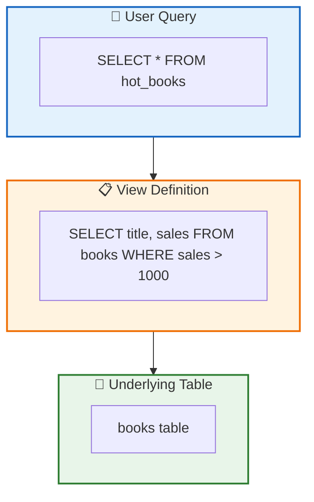

# 第六章：视图与安全

本章将介绍两个强大的 SQL 工具——视图（Views）和公用表表达式（CTE）。你将学习如何使用视图简化复杂查询、保护敏感数据，以及如何利用 CTE 编写更清晰、更易维护的 SQL 语句。通过本章学习，你将掌握处理复杂数据查询的高级技巧。

## 1. 视图（Views）

### 1.1 什么是视图

**视图（View）** 是由查询定义的**虚拟表**。它不存储实际数据，而是基于一个或多个表的查询结果动态生成。



**视图的特点：**

| 特性   | 说明                                   |
| ------ | -------------------------------------- |
| 虚拟性 | 不占用存储空间（存储的是定义而非数据） |
| 动态性 | 每次查询都重新执行底层 SQL             |
| 透明性 | 用户可以像查询表一样查询视图           |
| 安全性 | 可以限制用户只能看到特定列或行         |

### 1.2 创建视图

使用 `CREATE VIEW` 语句创建视图：

```sql
CREATE VIEW view_name AS
SELECT column1, column2, ...
FROM table_name
WHERE condition;
```

**示例：创建一个"热销书籍"视图**

```sql
-- 假设有 books 表和 orders 表
CREATE VIEW hot_books AS
SELECT
    b.id,
    b.title,
    b.author,
    COUNT(o.id) AS order_count,
    SUM(o.quantity) AS total_sold
FROM books b
LEFT JOIN orders o ON b.id = o.book_id
GROUP BY b.id, b.title, b.author
HAVING total_sold > 10;

-- 像查询表一样查询视图
SELECT * FROM hot_books ORDER BY total_sold DESC;
```

**创建视图时指定列名：**

```sql
CREATE VIEW book_summary (
    book_id,
    book_title,
    author_name,
    sales_volume
) AS
SELECT
    b.id,
    b.title,
    a.name,
    COALESCE(SUM(o.quantity), 0)
FROM books b
JOIN authors a ON b.author_id = a.id
LEFT JOIN orders o ON b.id = o.book_id
GROUP BY b.id, b.title, a.name;
```

### 1.3 视图的使用场景

#### 场景1：简化复杂查询

将经常使用的复杂查询封装成视图：

```sql
-- 复杂的销售统计查询
CREATE VIEW monthly_sales AS
SELECT
    strftime('%Y-%m', o.order_date) AS month,
    c.name AS category,
    COUNT(DISTINCT o.id) AS order_count,
    SUM(o.quantity) AS total_quantity,
    SUM(o.quantity * b.price) AS total_revenue
FROM orders o
JOIN books b ON o.book_id = b.id
JOIN categories c ON b.category_id = c.id
GROUP BY month, category;

-- 使用视图变得简单
SELECT * FROM monthly_sales WHERE month = '2024-01';
```

#### 场景2：数据安全（隐藏敏感列）

```sql
-- users 表包含敏感信息
CREATE TABLE users (
    id INTEGER PRIMARY KEY,
    username TEXT,
    email TEXT,
    phone TEXT,         -- 敏感
    id_card TEXT,       -- 敏感
    password_hash TEXT, -- 敏感
    created_at TEXT
);

-- 创建公开视图，隐藏敏感列
CREATE VIEW public_users AS
SELECT id, username, created_at
FROM users;

-- 普通用户只能访问视图
SELECT * FROM public_users;
```

#### 场景3：行级安全（只显示特定数据）

```sql
-- 销售只能看自己负责区域的订单
CREATE VIEW my_region_orders AS
SELECT *
FROM orders
WHERE region_id = CURRENT_USER_REGION_ID();  -- 假设有函数获取当前用户区域

-- 员工只能看自己部门的员工信息
CREATE VIEW my_department AS
SELECT *
FROM employees
WHERE department_id = (SELECT department_id FROM employees WHERE id = CURRENT_USER_ID());
```

#### 场景4：数据抽象（向后兼容）

当表结构变更时，用视图保持旧接口：

```sql
-- 原表结构：books(id, title, author_name)
-- 新表结构：books(id, title) + authors(id, name)

-- 创建兼容视图，旧代码无需修改
CREATE VIEW books_legacy AS
SELECT
    b.id,
    b.title,
    a.name AS author_name
FROM books b
LEFT JOIN authors a ON b.author_id = a.id;

-- 旧查询仍然可以工作
SELECT * FROM books_legacy WHERE author_name = '刘慈欣';
```

### 1.4 可更新视图

某些视图可以通过 `INSERT`、`UPDATE`、`DELETE` 修改底层数据。

**可更新视图的条件：**

- 基于单个表
- 不包含聚合函数（SUM、COUNT 等）
- 不包含 GROUP BY、HAVING、DISTINCT
- 不包含 UNION

```sql
-- 可更新视图示例
CREATE VIEW active_books AS
SELECT id, title, author, price, stock
FROM books
WHERE is_deleted = 0;

-- 可以更新
UPDATE active_books SET price = 99 WHERE id = 1;
-- 相当于：UPDATE books SET price = 99 WHERE id = 1 AND is_deleted = 0;

-- 可以插入
INSERT INTO active_books (title, author, price) VALUES ('新书', '作者', 50);
-- 相当于：INSERT INTO books (title, author, price, is_deleted) VALUES ('新书', '作者', 50, 0);
```

**不可更新视图：**

```sql
-- 包含聚合，不可更新
CREATE VIEW book_sales AS
SELECT book_id, SUM(quantity) AS total_sold
FROM orders
GROUP BY book_id;

-- 错误！无法更新
UPDATE book_sales SET total_sold = 100 WHERE book_id = 1;
```

### 1.5 使用 INSTEAD OF 触发器

对于不可更新的视图，可以使用触发器实现更新：

```sql
-- 复杂视图
CREATE VIEW order_details AS
SELECT
    o.id,
    u.username,
    b.title AS book_title,
    o.quantity,
    o.order_date
FROM orders o
JOIN users u ON o.user_id = u.id
JOIN books b ON o.book_id = b.id;

-- 创建 INSTEAD OF 触发器处理插入
CREATE TRIGGER trg_insert_order_details
INSTEAD OF INSERT ON order_details
FOR EACH ROW
BEGIN
    -- 将插入转换为对 orders 表的插入
    INSERT INTO orders (user_id, book_id, quantity, order_date)
    SELECT
        (SELECT id FROM users WHERE username = NEW.username),
        (SELECT id FROM books WHERE title = NEW.book_title),
        NEW.quantity,
        NEW.order_date;
END;
```

### 1.6 修改和删除视图

```sql
-- 修改视图（删除后重建）
DROP VIEW IF EXISTS hot_books;

CREATE VIEW hot_books AS
SELECT
    b.id,
    b.title,
    b.author,
    SUM(o.quantity) AS total_sold,
    RANK() OVER (ORDER BY SUM(o.quantity) DESC) AS sales_rank  -- 新增排名
FROM books b
LEFT JOIN orders o ON b.id = o.book_id
GROUP BY b.id, b.title, b.author
HAVING total_sold > 5;

-- SQLite 3.24.0+ 支持 CREATE VIEW IF NOT EXISTS 和 REPLACE
CREATE VIEW IF NOT EXISTS hot_books AS ...;
```

## 2. 公用表表达式（CTE）

**公用表表达式（Common Table Expressions，CTE）** 是在单个查询执行期间存在的临时结果集。

### 2.1 基本语法

使用 `WITH` 关键字定义 CTE：

```sql
WITH cte_name AS (
    SELECT ...
)
SELECT * FROM cte_name;
```

**简单示例：**

```sql
-- 查询价格高于平均水平的书籍
WITH avg_price AS (
    SELECT AVG(price) AS value FROM books
)
SELECT title, price
FROM books, avg_price
WHERE books.price > avg_price.value;
```

### 2.2 多个 CTE

可以在一个 WITH 子句中定义多个 CTE，用逗号分隔：

```sql
WITH
    top_authors AS (
        SELECT author_id, COUNT(*) AS book_count
        FROM books
        GROUP BY author_id
        HAVING book_count >= 3
    ),
    top_books AS (
        SELECT b.*
        FROM books b
        JOIN top_authors ta ON b.author_id = ta.author_id
    )
SELECT * FROM top_books ORDER BY price DESC;
```

### 2.3 递归 CTE

递归 CTE 可以查询层级数据，如组织架构、分类树等。

**语法：**

```sql
WITH RECURSIVE cte_name AS (
    -- 锚点成员：起始点
    SELECT ... FROM ... WHERE ...

    UNION ALL

    -- 递归成员：引用 CTE 自身
    SELECT ... FROM cte_name JOIN ... WHERE ...
)
SELECT * FROM cte_name;
```

**示例：查询员工的汇报层级**

```sql
-- 员工表
CREATE TABLE employees (
    id INTEGER PRIMARY KEY,
    name TEXT,
    manager_id INTEGER,
    FOREIGN KEY (manager_id) REFERENCES employees(id)
);

-- 插入数据
INSERT INTO employees VALUES
(1, 'CEO', NULL),
(2, 'CTO', 1),
(3, 'CFO', 1),
(4, '技术经理A', 2),
(5, '技术经理B', 2),
(6, '开发1', 4),
(7, '开发2', 4),
(8, '开发3', 5);

-- 递归查询：查找员工 6 的所有上级
WITH RECURSIVE management_chain AS (
    -- 锚点：从员工 6 开始
    SELECT id, name, manager_id, 0 AS level
    FROM employees
    WHERE id = 6

    UNION ALL

    -- 递归：找到上级的上级
    SELECT e.id, e.name, e.manager_id, mc.level + 1
    FROM employees e
    JOIN management_chain mc ON e.id = mc.manager_id
)
SELECT * FROM management_chain;

-- 结果：
-- id  name        manager_id  level
-- 6   开发1       4           0
-- 4   技术经理A   2           1
-- 2   CTO         1           2
-- 1   CEO         NULL        3
```

**示例：查询某经理的所有下属**

```sql
-- 查询员工 2（CTO）的所有下属
WITH RECURSIVE subordinates AS (
    -- 锚点：从 CTO 开始
    SELECT id, name, manager_id, 0 AS level
    FROM employees
    WHERE id = 2

    UNION ALL

    -- 递归：找到所有下属
    SELECT e.id, e.name, e.manager_id, s.level + 1
    FROM employees e
    JOIN subordinates s ON e.manager_id = s.id
)
SELECT * FROM subordinates WHERE level > 0 ORDER BY level;

-- 结果：
-- id  name        manager_id  level
-- 4   技术经理A   2           1
-- 5   技术经理B   2           1
-- 6   开发1       4           2
-- 7   开发2       4           2
-- 8   开发3       5           2
```

**示例：分类树查询**

```sql
-- 分类表（自引用）
CREATE TABLE categories (
    id INTEGER PRIMARY KEY,
    name TEXT,
    parent_id INTEGER,
    FOREIGN KEY (parent_id) REFERENCES categories(id)
);

-- 插入数据
INSERT INTO categories VALUES
(1, '图书', NULL),
(2, '技术', 1),
(3, '文学', 1),
(4, '数据库', 2),
(5, '编程', 2),
(6, '小说', 3),
(7, 'SQL入门', 4),
(8, 'Python基础', 5);

-- 查询 "技术" 分类下的所有子分类（包含层级路径）
WITH RECURSIVE category_tree AS (
    SELECT
        id,
        name,
        parent_id,
        name AS path,
        0 AS depth
    FROM categories
    WHERE name = '技术'

    UNION ALL

    SELECT
        c.id,
        c.name,
        c.parent_id,
        ct.path || ' > ' || c.name,
        ct.depth + 1
    FROM categories c
    JOIN category_tree ct ON c.parent_id = ct.id
)
SELECT name, path, depth FROM category_tree ORDER BY path;

-- 结果：
-- name        path                          depth
-- 技术        技术                          0
-- 数据库      技术 > 数据库                  1
-- SQL入门     技术 > 数据库 > SQL入门        2
-- 编程        技术 > 编程                    1
-- Python基础  技术 > 编程 > Python基础       2
```

### 2.4 CTE vs 子查询

| 对比项       | CTE (WITH)                 | 子查询           |
| ------------ | -------------------------- | ---------------- |
| **可读性**   | 优秀，命名清晰，可复用     | 较差，嵌套难读   |
| **复用性**   | 可在同一查询中多次引用     | 每次使用都需重写 |
| **递归支持** | 支持递归 CTE               | 不支持递归       |
| **性能**     | 通常相同（优化器处理相似） | 通常相同         |
| **标准支持** | SQL:1999 引入              | 基础 SQL 支持    |

**示例对比：查询每个分类的书籍数量及其占比**

❌ **子查询版本**（难以阅读）：

```sql
SELECT
    c.name AS category,
    c.book_count,
    ROUND(c.book_count * 100.0 / (SELECT SUM(book_count) FROM (
        SELECT COUNT(*) AS book_count FROM books GROUP BY category_id
    )), 2) AS percentage
FROM (
    SELECT c.id, c.name, COUNT(b.id) AS book_count
    FROM categories c
    LEFT JOIN books b ON c.id = b.category_id
    GROUP BY c.id, c.name
) c;
```

✅ **CTE 版本**（清晰易读）：

```sql
WITH
    category_stats AS (
        SELECT
            c.id,
            c.name,
            COUNT(b.id) AS book_count
        FROM categories c
        LEFT JOIN books b ON c.id = b.category_id
        GROUP BY c.id, c.name
    ),
    total_stats AS (
        SELECT SUM(book_count) AS total FROM category_stats
    )
SELECT
    cs.name AS category,
    cs.book_count,
    ROUND(cs.book_count * 100.0 / ts.total, 2) AS percentage
FROM category_stats cs, total_stats ts;
```

**何时使用 CTE：**

- ✅ 查询逻辑复杂，需要分步骤表达
- ✅ 同一子查询需要多次引用
- ✅ 需要递归查询层级数据
- ✅ 提高代码可读性和可维护性

**何时使用子查询：**

- ✅ 简单的单次使用查询
- ✅ 不需要命名的临时结果
- ✅ 数据库不支持 CTE（如旧版本 MySQL）

## 3. 完整示例：图书销售分析系统

```sql
-- 1. 创建基础表
CREATE TABLE books (
    id INTEGER PRIMARY KEY,
    title TEXT NOT NULL,
    author_id INTEGER,
    category_id INTEGER,
    price REAL NOT NULL,
    publish_year INTEGER
);

CREATE TABLE authors (
    id INTEGER PRIMARY KEY,
    name TEXT NOT NULL,
    country TEXT
);

CREATE TABLE categories (
    id INTEGER PRIMARY KEY,
    name TEXT NOT NULL,
    parent_id INTEGER
);

CREATE TABLE sales (
    id INTEGER PRIMARY KEY,
    book_id INTEGER,
    quantity INTEGER,
    sale_date TEXT
);

-- 2. 插入示例数据
INSERT INTO authors VALUES
(1, '刘慈欣', '中国'),
(2, '余华', '中国'),
(3, 'J.K.罗琳', '英国');

INSERT INTO categories VALUES
(1, '图书', NULL),
(2, '科幻', 1),
(3, '文学', 1);

INSERT INTO books VALUES
(1, '三体', 1, 2, 59.00, 2008),
(2, '流浪地球', 1, 2, 35.00, 2019),
(3, '活着', 2, 3, 28.00, 1993),
(4, '哈利波特', 3, 2, 68.00, 2000);

INSERT INTO sales VALUES
(1, 1, 100, '2024-01-15'),
(2, 1, 150, '2024-02-20'),
(3, 2, 80, '2024-01-20'),
(4, 3, 200, '2024-03-01'),
(5, 4, 120, '2024-02-10');

-- 3. 创建实用视图

-- 3.1 销售统计视图
CREATE VIEW v_book_sales AS
SELECT
    b.id,
    b.title,
    a.name AS author,
    c.name AS category,
    b.price,
    COALESCE(SUM(s.quantity), 0) AS total_sold,
    COALESCE(SUM(s.quantity * b.price), 0) AS total_revenue
FROM books b
JOIN authors a ON b.author_id = a.id
JOIN categories c ON b.category_id = c.id
LEFT JOIN sales s ON b.id = s.book_id
GROUP BY b.id, b.title, a.name, c.name, b.price;

-- 使用视图
SELECT * FROM v_book_sales ORDER BY total_revenue DESC;

-- 3.2 月度销售趋势视图
CREATE VIEW v_monthly_trend AS
SELECT
    strftime('%Y-%m', s.sale_date) AS month,
    c.name AS category,
    SUM(s.quantity) AS quantity,
    SUM(s.quantity * b.price) AS revenue
FROM sales s
JOIN books b ON s.book_id = b.id
JOIN categories c ON b.category_id = c.id
GROUP BY month, category;

-- 4. 使用 CTE 进行复杂分析

-- 4.1 找出销量前 3 的书籍（使用 CTE 和窗口函数）
WITH ranked_books AS (
    SELECT
        b.title,
        SUM(s.quantity) AS total_sold,
        RANK() OVER (ORDER BY SUM(s.quantity) DESC) AS rank
    FROM books b
    JOIN sales s ON b.id = s.book_id
    GROUP BY b.id, b.title
)
SELECT title, total_sold
FROM ranked_books
WHERE rank <= 3;

-- 4.2 计算每个分类的销售占比
WITH category_revenue AS (
    SELECT
        c.name,
        SUM(s.quantity * b.price) AS revenue
    FROM categories c
    JOIN books b ON c.id = b.category_id
    JOIN sales s ON b.id = s.book_id
    GROUP BY c.id, c.name
),
total AS (
    SELECT SUM(revenue) AS total_revenue FROM category_revenue
)
SELECT
    cr.name,
    cr.revenue,
    ROUND(cr.revenue * 100.0 / t.total_revenue, 2) AS percentage
FROM category_revenue cr, total t;

-- 4.3 递归查询分类层级
WITH RECURSIVE category_tree AS (
    SELECT
        id,
        name,
        parent_id,
        name AS full_path
    FROM categories
    WHERE parent_id IS NULL

    UNION ALL

    SELECT
        c.id,
        c.name,
        c.parent_id,
        ct.full_path || ' > ' || c.name
    FROM categories c
    JOIN category_tree ct ON c.parent_id = ct.id
)
SELECT name, full_path FROM category_tree;
```

## 4. 本章小结

### 核心概念回顾

| 概念/语法             | 一句话理解                           |
| --------------------- | ------------------------------------ |
| **视图 (View)**       | 由查询定义的虚拟表，不存储实际数据   |
| **CREATE VIEW**       | 创建视图的语句                       |
| **可更新视图**        | 可以执行 INSERT/UPDATE/DELETE 的视图 |
| **INSTEAD OF 触发器** | 使不可更新视图支持修改的机制         |
| **CTE (WITH)**        | 查询期间存在的临时结果集             |
| **递归 CTE**          | 使用 RECURSIVE 关键字处理层级数据    |
| **锚点成员**          | 递归 CTE 的起始点                    |
| **递归成员**          | 引用 CTE 自身进行递归的部分          |

### 视图 vs CTE 对比

| 特性         | 视图                   | CTE                      |
| ------------ | ---------------------- | ------------------------ |
| **持久性**   | 持久化存储在数据库中   | 单次查询有效             |
| **复用范围** | 所有会话可用           | 当前查询可用             |
| **递归支持** | 不支持                 | 支持                     |
| **适用场景** | 常用查询封装、权限控制 | 复杂查询分步、一次性分析 |

### 最佳实践

**视图使用建议：**

1. **命名规范**：视图名以 `v_` 或 `view_` 开头，便于识别
2. **避免过度嵌套**：视图基于视图会降低性能
3. **文档注释**：复杂视图应添加注释说明用途
4. **权限管理**：利用视图实现列级和行级安全

**CTE 使用建议：**

1. **命名清晰**：CTE 名称应描述其内容
2. **适度拆分**：过于细碎的 CTE 反而降低可读性
3. **递归终止**：确保递归 CTE 有终止条件，避免无限循环
4. **性能意识**：CTE 不一定比子查询快，但更易维护

### 学习路径预告

至此，你已经掌握了 SQL 的核心技能：

- ✅ 数据库设计与规范化
- ✅ 基础查询与过滤
- ✅ 多表关联与聚合
- ✅ 数据增删改操作
- ✅ 视图与 CTE

后续可以学习：

- 索引与查询优化
- 事务与并发控制
- 存储过程与函数
- 数据库安全与备份
