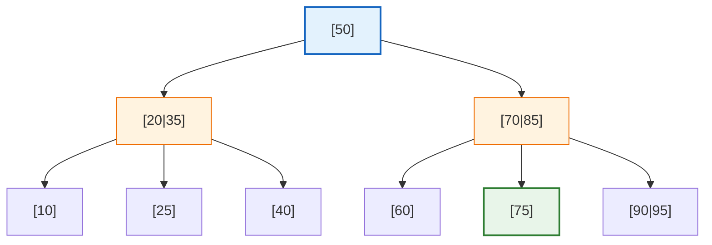
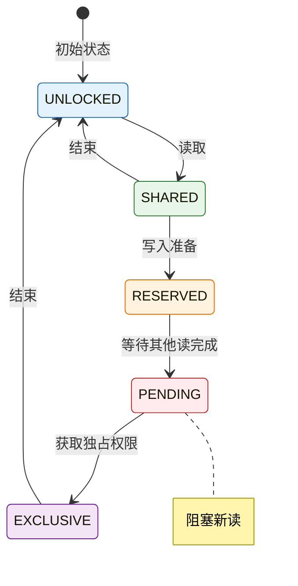

# 第七章：性能优化

本章将介绍数据库性能优化的核心概念和技术。你将学习索引的工作原理、事务的 ACID 特性，以及数据库锁机制。通过本章学习，你将能够设计高性能的数据库结构，编写高效的查询语句，并理解数据库并发控制的基本原理。

## 1. 索引（Index）

**索引**是数据库中用于加速数据检索的数据结构。类似于书籍的目录，索引让数据库可以快速定位数据，而无需扫描整个表。

### 1.1 为什么需要索引

假设有一个包含 100 万条记录的 `books` 表：

```sql
-- 没有索引：全表扫描（Table Scan）
-- 数据库需要逐行检查，直到找到匹配的记录
-- 时间复杂度：O(n)，平均需要扫描 50 万行
SELECT * FROM books WHERE id = 500000;

-- 有索引：B-Tree 查找
-- 数据库通过索引树快速定位
-- 时间复杂度：O(log n)，最多只需要约 20 次比较
```

### 1.2 B-Tree 索引结构

SQLite 使用 **B-Tree（平衡树）** 作为索引的数据结构。



**查找 75 的过程：**

1. 从根节点 `[50]` 开始，75 > 50，走右子树
2. 到节点 `[70|85]`，70 < 75 < 85，走中间分支
3. 到叶子节点 `[75]`，找到目标（绿色高亮）

只需 3 次比较，无需扫描整个表

**B-Tree 的特点：**

| 特点         | 说明                                   |
| ------------ | -------------------------------------- |
| **平衡**     | 所有叶子节点深度相同，保证查询效率稳定 |
| **有序**     | 数据按键值排序，支持范围查询           |
| **多路**     | 每个节点可以有多个子节点，减少树高     |
| **磁盘友好** | 节点大小与磁盘页对齐，减少 I/O 次数    |

### 1.3 创建索引

使用 `CREATE INDEX` 语句创建索引：

```sql
-- 基本语法
CREATE INDEX index_name ON table_name(column);

-- 示例：为 books 表的 title 列创建索引
CREATE INDEX idx_books_title ON books(title);

-- 唯一索引（确保列值唯一）
CREATE UNIQUE INDEX idx_books_isbn ON books(isbn);

-- 复合索引（多列索引）
CREATE INDEX idx_books_author_year ON books(author_id, publish_year);
```

**查看索引：**

```sql
-- SQLite 中查看表的索引
.indexes books

-- 或通过查询系统表
SELECT name, sql FROM sqlite_master WHERE type = 'index' AND tbl_name = 'books';
```

### 1.4 索引的使用场景

**适合创建索引的情况：**

| 场景           | 示例                 |
| -------------- | -------------------- |
| **WHERE 条件** | 经常用于查询条件的列 |
| **JOIN 条件**  | 外键列、连接条件列   |
| **排序**       | ORDER BY 使用的列    |
| **分组**       | GROUP BY 使用的列    |
| **唯一性**     | 需要确保唯一的列     |

```sql
-- 为常用查询条件创建索引
CREATE INDEX idx_books_category ON books(category_id);

-- 为外键创建索引（加速 JOIN）
CREATE INDEX idx_orders_book_id ON orders(book_id);
CREATE INDEX idx_orders_user_id ON orders(user_id);

-- 为排序和范围查询创建索引
CREATE INDEX idx_books_price ON books(price);
CREATE INDEX idx_books_publish_year ON books(publish_year);
```

**不适合创建索引的情况：**

| 场景             | 原因                          |
| ---------------- | ----------------------------- |
| **小表**         | 全表扫描比索引查找更快        |
| **频繁更新的列** | 维护索引开销大                |
| **低基数列**     | 如性别（只有男/女），区分度低 |
| **很少查询的列** | 索引维护成本高于收益          |

### 1.5 索引的权衡

索引虽然能加速查询，但也有成本：

**优点：**

- ✅ 大幅加速 SELECT 查询
- ✅ 加速 JOIN 操作
- ✅ 加速 ORDER BY 和 GROUP BY
- ✅ 强制数据唯一性（UNIQUE 索引）

**缺点：**

- ❌ **占用存储空间**：索引需要额外的磁盘空间
- ❌ **降低写入速度**：INSERT/UPDATE/DELETE 需要维护索引
- ❌ **增加维护成本**：数据库需要自动维护索引结构

```
写入性能对比：

无索引表：
INSERT → 直接插入数据 → 完成

有索引表：
INSERT → 插入数据 → 更新索引1 → 更新索引2 → ... → 完成
```

**示例：测试索引对写入的影响**

```sql
-- 创建测试表
CREATE TABLE test_no_index (
    id INTEGER PRIMARY KEY,
    data TEXT
);

CREATE TABLE test_with_index (
    id INTEGER PRIMARY KEY,
    data TEXT
);

CREATE INDEX idx_data ON test_with_index(data);

-- 批量插入测试：有索引的表会更慢
-- （具体时间取决于硬件，通常慢 2-5 倍）
```

### 1.6 覆盖索引（Covering Index）

**覆盖索引**是指索引包含了查询所需的所有列，数据库无需回表查询原始数据。

```sql
-- 创建复合索引
CREATE INDEX idx_books_covering ON books(category_id, title, price);

-- 覆盖索引查询：所有需要的数据都在索引中
SELECT title, price FROM books WHERE category_id = 1;
-- 查询计划：使用索引 idx_books_covering（覆盖索引扫描）

-- 非覆盖索引查询：需要回表获取 author 列
SELECT title, author FROM books WHERE category_id = 1;
-- 查询计划：使用索引 + 回表查询
```

**覆盖索引的优势：**

- 避免回表查询，减少 I/O
- 查询性能显著提升（通常 2-10 倍）

### 1.7 索引优化实践

**1. 使用 EXPLAIN QUERY PLAN 分析查询：**

```sql
-- 查看查询执行计划
EXPLAIN QUERY PLAN SELECT * FROM books WHERE title = '三体';

-- 结果示例：
-- SCAN TABLE books                    ← 全表扫描（慢）
-- SEARCH TABLE books USING INDEX idx_books_title  ← 索引查找（快）
```

**2. 最左前缀原则：**

复合索引 `(a, b, c)` 可以用于：

- ✅ `WHERE a = ?`
- ✅ `WHERE a = ? AND b = ?`
- ✅ `WHERE a = ? AND b = ? AND c = ?`
- ✅ `WHERE a = ? AND c = ?`（只用 a）
- ❌ `WHERE b = ?`（跳过 a，无法使用）
- ❌ `WHERE c = ?`（跳过 a、b，无法使用）

```sql
-- 复合索引 (author_id, publish_year)
CREATE INDEX idx_author_year ON books(author_id, publish_year);

-- ✅ 使用索引
SELECT * FROM books WHERE author_id = 1;
SELECT * FROM books WHERE author_id = 1 AND publish_year = 2020;

-- ❌ 不使用索引（缺少最左列）
SELECT * FROM books WHERE publish_year = 2020;
```

**3. 定期分析和优化：**

```sql
-- SQLite 中分析表
ANALYZE books;

-- 查看索引统计信息（SQLite 3.16.0+）
SELECT * FROM sqlite_stat1 WHERE tbl = 'books';
```

### 1.8 删除索引

```sql
-- 删除不再需要的索引
DROP INDEX IF EXISTS idx_books_title;

-- 何时删除索引：
-- 1. 索引从未被使用（通过查询计划分析）
-- 2. 索引的维护成本超过查询收益
-- 3. 表数据量很小，索引无益
```

## 2. 事务（Transactions）

**事务**是一组 SQL 操作的逻辑单元，这些操作要么全部成功，要么全部失败。

### 2.1 为什么需要事务

**银行转账示例：**

```
从账户 A 转账 1000 元到账户 B：

操作1：账户 A 余额减少 1000 元
操作2：账户 B 余额增加 1000 元

问题：如果操作1成功后，系统崩溃，操作2未执行：
- 账户 A 少了 1000 元
- 账户 B 没有增加 1000 元
- 1000 元凭空消失！

解决方案：将两个操作包装在一个事务中
```

### 2.2 ACID 属性

事务必须满足 **ACID** 四个特性：

| 特性       | 英文        | 含义     | 说明                                   |
| ---------- | ----------- | -------- | -------------------------------------- |
| **原子性** | Atomicity   | 不可分割 | 事务中的所有操作要么全成功，要么全失败 |
| **一致性** | Consistency | 数据一致 | 事务执行前后，数据库处于一致状态       |
| **隔离性** | Isolation   | 相互隔离 | 并发事务互不干扰                       |
| **持久性** | Durability  | 永久保存 | 提交后数据永久保存，即使系统崩溃       |

#### 原子性（Atomicity）

```sql
BEGIN TRANSACTION;

UPDATE accounts SET balance = balance - 1000 WHERE id = 'A';
UPDATE accounts SET balance = balance + 1000 WHERE id = 'B';

-- 如果任何一步出错，全部回滚
COMMIT;  -- 全部成功，提交事务
-- 或
ROLLBACK; -- 出错，撤销所有更改
```

#### 一致性（Consistency）

```sql
-- 约束确保一致性
CREATE TABLE accounts (
    id TEXT PRIMARY KEY,
    balance INTEGER CHECK(balance >= 0)  -- 余额不能为负
);

BEGIN TRANSACTION;
UPDATE accounts SET balance = balance - 1000 WHERE id = 'A';  -- A 有 500
-- 错误！CHECK 约束失败，事务自动回滚
-- 数据库保持一致的：没有负余额
COMMIT;
```

#### 隔离性（Isolation）

```sql
-- 事务1
BEGIN TRANSACTION;
UPDATE books SET stock = stock - 1 WHERE id = 1;  -- stock: 10 -> 9
-- 此时事务2 看不到这个更改，它看到 stock 还是 10
COMMIT;

-- 事务2（并发执行）
BEGIN TRANSACTION;
SELECT stock FROM books WHERE id = 1;  -- 返回 10（未看到事务1的更改）
UPDATE books SET stock = stock - 1 WHERE id = 1;  -- stock: 10 -> 9
COMMIT;

-- 最终结果：stock = 8（两次减1）
-- 如果没有隔离性，可能出现脏读、不可重复读等问题
```

#### 持久性（Durability）

```sql
BEGIN TRANSACTION;
UPDATE accounts SET balance = 10000 WHERE id = 'A';
COMMIT;

-- 即使立即断电，数据也已经写入磁盘
-- 重启后，balance 仍然是 10000
```

### 2.3 SQLite 中的事务

SQLite 有三种事务模式：

```sql
-- 默认模式（DEFERRED）：BEGIN 时不获取锁
BEGIN;
-- 或
BEGIN DEFERRED;

-- 立即模式（IMMEDIATE）：BEGIN 时获取 RESERVED 锁
BEGIN IMMEDIATE;

-- 独占模式（EXCLUSIVE）：BEGIN 时获取 EXCLUSIVE 锁
BEGIN EXCLUSIVE;
```

**事务命令：**

```sql
-- 开始事务
BEGIN TRANSACTION;

-- 或简写
BEGIN;

-- 提交事务（保存更改）
COMMIT;

-- 回滚事务（撤销更改）
ROLLBACK;
```

**完整示例：**

```sql
-- 库存扣减 + 订单创建的事务
BEGIN TRANSACTION;

-- 检查库存
SELECT stock FROM products WHERE id = 1;
-- 应用程序检查 stock >= 购买数量

-- 扣减库存
UPDATE products SET stock = stock - 2 WHERE id = 1 AND stock >= 2;

-- 如果更新影响行数为 0，说明库存不足，回滚
-- 如果更新成功，继续创建订单

INSERT INTO orders (user_id, product_id, quantity) VALUES (100, 1, 2);

-- 全部成功，提交
COMMIT;

-- 或出错时回滚
-- ROLLBACK;
```

### 2.4 保存点（Savepoints）

保存点允许在事务中设置回滚点，实现部分回滚。

```sql
BEGIN TRANSACTION;

INSERT INTO orders (id, user_id) VALUES (1, 100);

-- 设置保存点
SAVEPOINT before_items;

INSERT INTO order_items (order_id, product_id, quantity) VALUES (1, 1, 2);
INSERT INTO order_items (order_id, product_id, quantity) VALUES (1, 2, 1);

-- 发现商品 2 库存不足，回滚到保存点
ROLLBACK TO SAVEPOINT before_items;

-- 只保留商品 1
INSERT INTO order_items (order_id, product_id, quantity) VALUES (1, 1, 2);

-- 提交整个事务
COMMIT;
```

## 3. 锁机制（Locks）

**锁**是数据库实现并发控制的基础机制，用于协调多个事务对数据的访问。

### 3.1 SQLite 的锁状态

SQLite 使用五种锁状态来管理并发访问：

| 锁状态       | 英文      | 说明           | 其他事务能否读取 | 其他事务能否写入 |
| ------------ | --------- | -------------- | ---------------- | ---------------- |
| **未锁定**   | UNLOCKED  | 无锁状态       | ✅               | ✅               |
| **共享锁**   | SHARED    | 读取数据时持有 | ✅               | ❌               |
| **保留锁**   | RESERVED  | 准备写入       | ✅               | ❌               |
| **待处理锁** | PENDING   | 等待写入       | ❌               | ❌               |
| **独占锁**   | EXCLUSIVE | 写入数据时持有 | ❌               | ❌               |

### 3.2 锁的升级过程

**读操作锁升级：** `UNLOCKED → SHARED → UNLOCKED`

**写操作锁升级：** `UNLOCKED → SHARED → RESERVED → PENDING → EXCLUSIVE → UNLOCKED`



### 3.3 读操作与锁

```sql
-- 事务1：读取数据（获取 SHARED 锁）
BEGIN;
SELECT * FROM books WHERE id = 1;  -- 获取 SHARED 锁
-- 其他事务可以同时读取
-- 其他事务不能写入
COMMIT;  -- 释放锁
```

**SHARED 锁特点：**

- 多个事务可以同时持有 SHARED 锁
- 持有 SHARED 锁时，其他事务不能获取 EXCLUSIVE 锁
- 读操作不会阻塞其他读操作

### 3.4 写操作与锁

```sql
-- 事务1：写入数据
BEGIN;
UPDATE books SET stock = stock - 1 WHERE id = 1;
-- 过程：
-- 1. 获取 SHARED 锁（读取要修改的数据）
-- 2. 升级为 RESERVED 锁（准备修改）
-- 3. 修改内存中的数据页
-- 4. 尝试升级为 EXCLUSIVE 锁
--    - 如果有其他事务持有 SHARED 锁，等待
-- 5. 写入磁盘
-- 6. 释放所有锁
COMMIT;
```

### 3.5 死锁（Deadlock）

**死锁**是指两个或多个事务相互等待对方释放资源，导致永久阻塞。

```
死锁示例：

事务1                      事务2
─────────────────────────────────────────
BEGIN;                     BEGIN;
UPDATE A;  ← 锁定 A        UPDATE B;  ← 锁定 B

UPDATE B;  ← 等待 B        UPDATE A;  ← 等待 A
（被事务2锁定）             （被事务1锁定）

结果：相互等待，死锁！
```

**SQLite 的死锁处理：**

- SQLite 使用**粗粒度锁**（数据库级锁而非行级锁）
- 当一个事务需要等待锁时，会返回 `SQLITE_BUSY` 错误
- 应用程序需要处理这个错误，重试或回滚

```python
# 伪代码：处理 busy 错误
while True:
    try:
        conn.execute("BEGIN IMMEDIATE")
        conn.execute("UPDATE books SET stock = stock - 1 WHERE id = 1")
        conn.commit()
        break
    except sqlite3.BusyError:
        time.sleep(0.1)  # 等待后重试
        continue
```

### 3.6 并发控制最佳实践

**1. 事务尽量简短：**

```sql
-- 好：事务简短
BEGIN;
UPDATE accounts SET balance = balance - 100 WHERE id = 'A';
UPDATE accounts SET balance = balance + 100 WHERE id = 'B';
COMMIT;

-- 不好：事务中包含用户交互
BEGIN;
UPDATE accounts SET balance = balance - 100 WHERE id = 'A';
-- 等待用户确认（可能很久）
UPDATE accounts SET balance = balance + 100 WHERE id = 'B';
COMMIT;
```

**2. 按固定顺序访问资源：**

```sql
-- 所有事务都按 A -> B 的顺序访问
-- 可以避免死锁

-- 事务1
BEGIN;
UPDATE accounts SET balance = balance - 100 WHERE id = 'A';
UPDATE accounts SET balance = balance + 100 WHERE id = 'B';
COMMIT;

-- 事务2
BEGIN;
UPDATE accounts SET balance = balance - 50 WHERE id = 'A';
UPDATE accounts SET balance = balance + 50 WHERE id = 'B';
COMMIT;
```

**3. 使用 IMMEDIATE 或 EXCLUSIVE 模式：**

```sql
-- 如果确定要写入，立即获取写锁
BEGIN IMMEDIATE;
-- 避免等待和其他事务冲突
```

## 4. 完整示例：高并发库存系统

```sql
-- 1. 创建表
CREATE TABLE products (
    id INTEGER PRIMARY KEY,
    name TEXT NOT NULL,
    stock INTEGER NOT NULL DEFAULT 0 CHECK(stock >= 0)
);

CREATE TABLE orders (
    id INTEGER PRIMARY KEY,
    product_id INTEGER,
    quantity INTEGER,
    status TEXT DEFAULT 'pending',
    created_at TEXT DEFAULT CURRENT_TIMESTAMP
);

-- 创建索引加速查询
CREATE INDEX idx_orders_product ON orders(product_id);
CREATE INDEX idx_orders_status ON orders(status);

-- 2. 插入测试数据
INSERT INTO products (id, name, stock) VALUES (1, 'iPhone', 100);

-- 3. 并发安全的库存扣减（使用乐观锁思想）
-- 方案1：使用事务 + 重试机制

/*
应用程序伪代码：

function purchase(product_id, quantity):
    max_retries = 3
    for i in range(max_retries):
        try:
            conn.execute("BEGIN IMMEDIATE")

            -- 检查库存
            result = conn.execute(
                "SELECT stock FROM products WHERE id = ?",
                (product_id,)
            ).fetchone()

            if not result or result[0] < quantity:
                conn.rollback()
                return "库存不足"

            -- 扣减库存
            conn.execute(
                "UPDATE products SET stock = stock - ? WHERE id = ?",
                (quantity, product_id)
            )

            -- 创建订单
            conn.execute(
                "INSERT INTO orders (product_id, quantity) VALUES (?, ?)",
                (product_id, quantity)
            )

            conn.commit()
            return "购买成功"

        except BusyError:
            conn.rollback()
            sleep(0.1 * (i + 1))  # 指数退避
            continue

    return "系统繁忙，请重试"
*/

-- 方案2：使用数据库约束（简单场景）
-- 利用 CHECK(stock >= 0) 约束防止超卖

BEGIN IMMEDIATE;

UPDATE products SET stock = stock - ? WHERE id = ? AND stock >= ?;
-- 如果影响行数为 0，说明库存不足

INSERT INTO orders (product_id, quantity) VALUES (?, ?);

COMMIT;

-- 4. 查询统计（使用覆盖索引）
CREATE INDEX idx_orders_covering ON orders(status, product_id, quantity);

-- 查询各商品的销售量（使用覆盖索引）
SELECT
    product_id,
    SUM(quantity) as total_sold
FROM orders
WHERE status = 'completed'
GROUP BY product_id;

-- 5. 性能分析
EXPLAIN QUERY PLAN
SELECT * FROM orders WHERE product_id = 1 AND status = 'completed';
-- 期望结果：SEARCH TABLE orders USING INDEX idx_orders_product
```

## 5. 本章小结

### 核心概念回顾

| 概念                   | 一句话理解                         |
| ---------------------- | ---------------------------------- |
| **索引 (Index)**       | 加速数据检索的数据结构             |
| **B-Tree**             | SQLite 使用的平衡树索引结构        |
| **覆盖索引**           | 包含查询所需所有列的索引，无需回表 |
| **事务 (Transaction)** | 一组原子性的 SQL 操作单元          |
| **ACID**               | 原子性、一致性、隔离性、持久性     |
| **COMMIT**             | 提交事务，保存更改                 |
| **ROLLBACK**           | 回滚事务，撤销更改                 |
| **保存点 (Savepoint)** | 事务内的部分回滚点                 |
| **锁 (Lock)**          | 控制并发访问的机制                 |
| **SHARED 锁**          | 读锁，允许多个读                   |
| **EXCLUSIVE 锁**       | 写锁，独占访问                     |
| **死锁**               | 事务相互等待导致的阻塞             |

### 索引 vs 无索引对比

| 操作         | 无索引        | 有索引             |
| ------------ | ------------- | ------------------ |
| **SELECT**   | O(n) 全表扫描 | O(log n) 索引查找  |
| **INSERT**   | 快            | 慢（需维护索引）   |
| **UPDATE**   | 快            | 慢（需更新索引）   |
| **DELETE**   | 快            | 慢（需删除索引项） |
| **存储空间** | 小            | 大（需要额外空间） |

### 事务使用 checklist

执行事务前检查：

- [ ] 事务是否尽可能简短？
- [ ] 是否处理了 `BUSY` 错误？
- [ ] 资源访问是否有固定顺序？
- [ ] 是否有合适的索引支持？
- [ ] 是否使用了 `EXPLAIN QUERY PLAN` 验证？

### 学习路径预告

至此，你已经掌握了数据库的核心技术：

- ✅ 数据库设计与规范化
- ✅ SQL 基础查询
- ✅ 多表关联与聚合
- ✅ 数据增删改操作
- ✅ 视图与 CTE
- ✅ **索引与性能优化**
- ✅ **事务与并发控制**

后续可以学习：

- 数据库备份与恢复
- 数据迁移与同步
- 数据库安全与权限管理
- 分布式数据库基础
