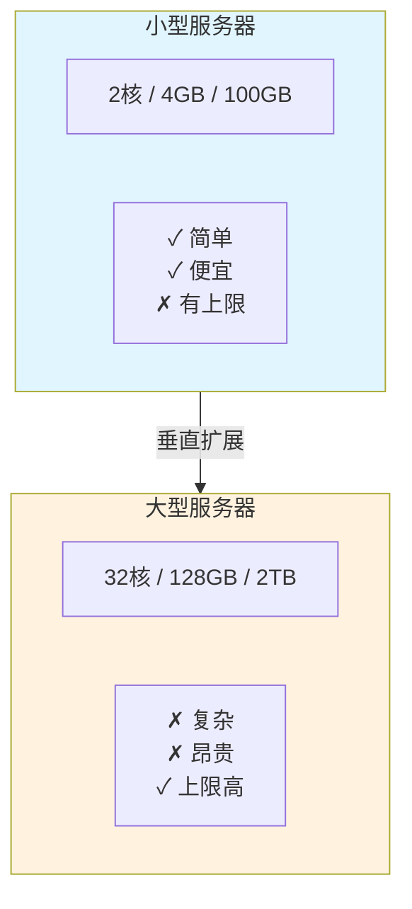
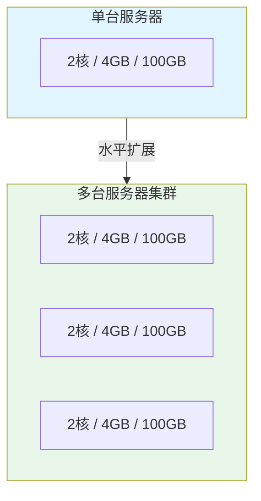
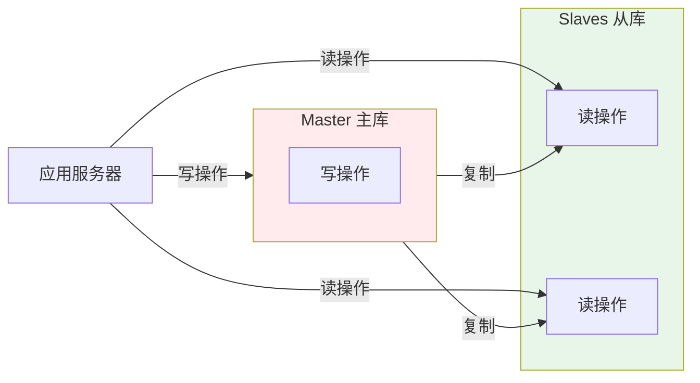
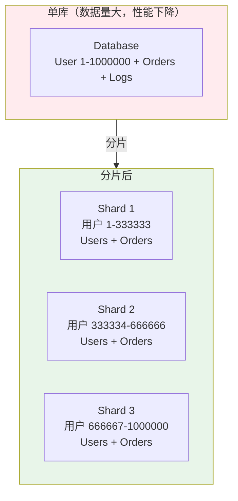
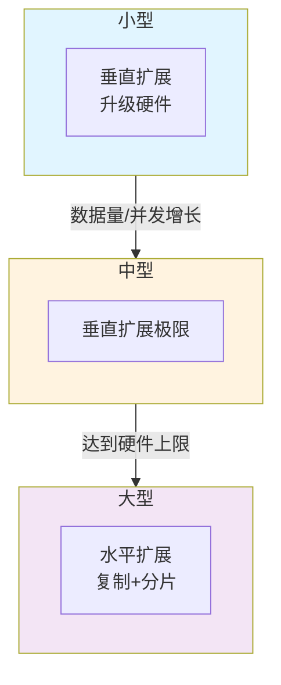
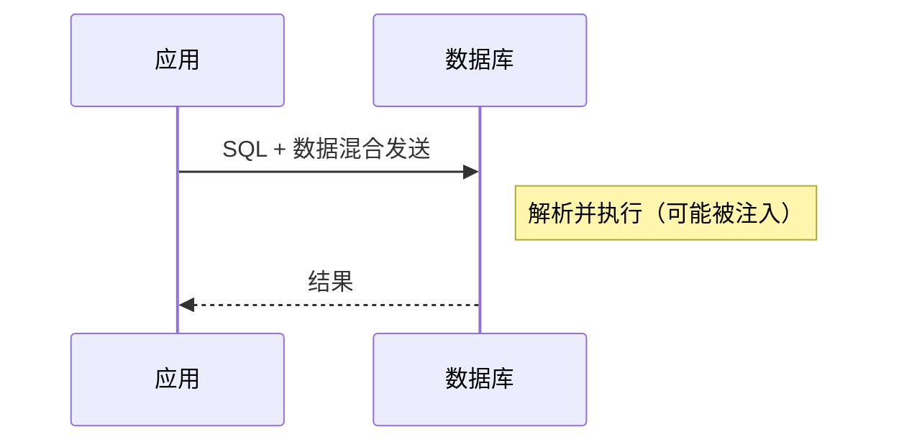
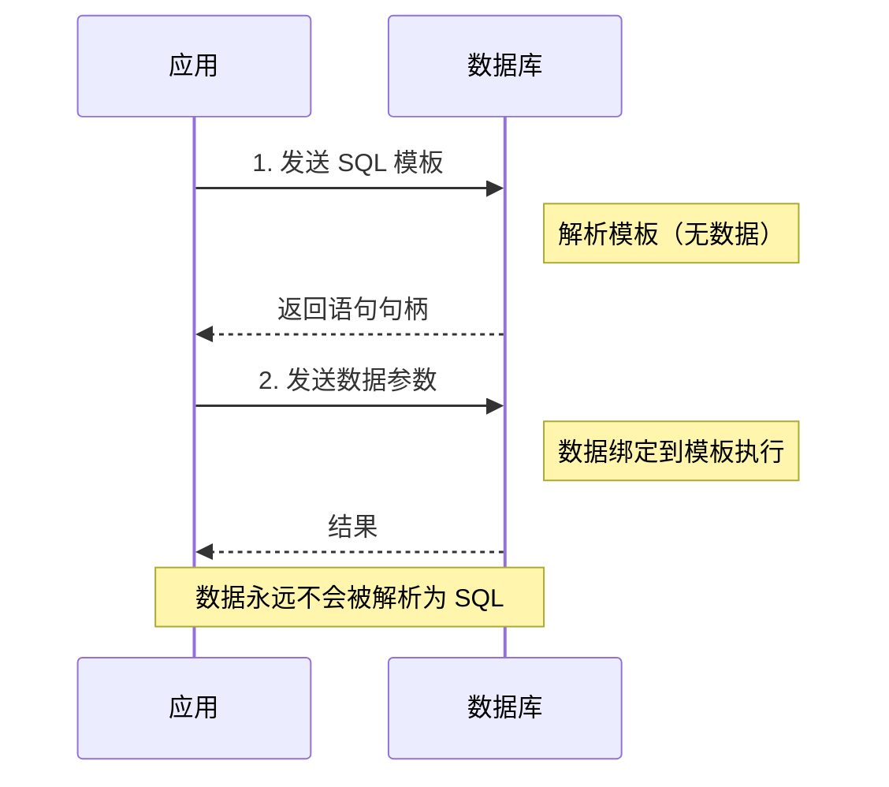
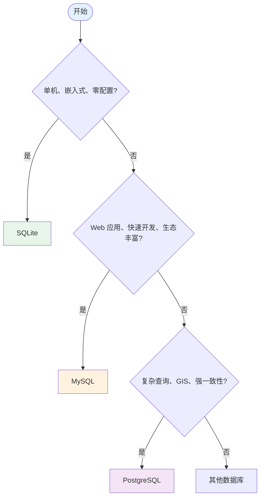
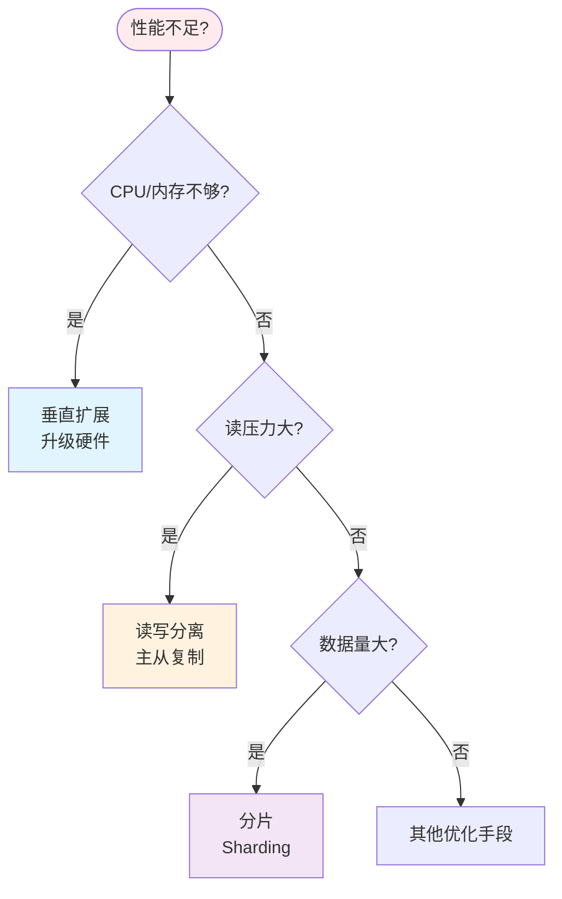

# 第八章：扩展与安全

本章将介绍数据库的扩展策略和安全防护。你将了解 MySQL 和 PostgreSQL 等服务器型数据库的特点，学习垂直扩展与水平扩展的区别，掌握复制和分片技术的基本概念。同时，你还将学习数据库安全的核心实践：访问控制和 SQL 注入防护。通过本章学习，你将对生产环境数据库的运维和安全有全面的认识。

## 1. 从 SQLite 到服务器型数据库

### 1.1 SQLite 的局限性

SQLite 是一个优秀的嵌入式数据库，但在以下场景中存在局限：

| 场景           | SQLite 局限                   |
| -------------- | ----------------------------- |
| **高并发写入** | 数据库级锁，写操作串行执行    |
| **大规模数据** | 单文件存储，TB 级数据管理困难 |
| **网络访问**   | 无内置网络服务，仅本地访问    |
| **用户权限**   | 文件级权限，无细粒度访问控制  |
| **高可用**     | 无内置主从复制、故障转移机制  |

### 1.2 MySQL 简介

**MySQL** 是世界上最流行的开源关系型数据库之一。

**特点：**

| 特性                  | 说明                                     |
| --------------------- | ---------------------------------------- |
| **客户端/服务器架构** | 独立的服务进程，支持远程连接             |
| **高并发**            | 支持数千并发连接                         |
| **丰富的存储引擎**    | InnoDB（事务安全）、MyISAM（高性能读）等 |
| **复制机制**          | 内置主从复制，支持读写分离               |
| **生态系统**          | LAMP 栈核心，文档丰富，社区活跃          |

**适用场景：**

- Web 应用（WordPress、Drupal、Laravel 等）
- 中小型电商系统
- 需要快速开发和部署的项目

**基本操作对比：**

```sql
-- SQLite: 直接连接文件
sqlite3 database.db

-- MySQL: 连接服务器
mysql -h localhost -u root -p

-- MySQL: 创建数据库
CREATE DATABASE bookstore CHARACTER SET utf8mb4 COLLATE utf8mb4_unicode_ci;
USE bookstore;

-- MySQL: 创建用户并授权
CREATE USER 'app_user'@'localhost' IDENTIFIED BY 'password';
GRANT SELECT, INSERT, UPDATE ON bookstore.* TO 'app_user'@'localhost';
```

### 1.3 PostgreSQL 简介

**PostgreSQL** 是一个功能强大的开源对象关系型数据库。

**特点：**

| 特性         | 说明                                   |
| ------------ | -------------------------------------- |
| **标准兼容** | 最符合 SQL 标准的数据库之一            |
| **高级类型** | 支持数组、JSON、地理信息等高级数据类型 |
| **扩展丰富** | PostGIS（地理）、TimescaleDB（时序）等 |
| **并发控制** | 多版本并发控制（MVCC），读写不阻塞     |
| **复杂查询** | 优化器强大，适合复杂分析和报表         |

**适用场景：**

- 金融系统（强一致性要求）
- 地理信息系统（GIS）
- 数据分析与数据仓库
- 需要复杂查询的企业应用

**PostgreSQL 特有功能：**

```sql
-- 数组类型
CREATE TABLE posts (
    id SERIAL PRIMARY KEY,
    title TEXT,
    tags TEXT[]  -- 字符串数组
);

INSERT INTO posts (title, tags) VALUES ('SQL 教程', '{database, sql, tutorial}');

-- JSONB 类型（二进制 JSON，支持索引）
CREATE TABLE users (
    id SERIAL PRIMARY KEY,
    profile JSONB
);

INSERT INTO users (profile) VALUES ('{"name": "张三", "age": 25}'::JSONB);

-- 查询 JSON 字段
SELECT * FROM users WHERE profile->>'name' = '张三';
```

### 1.4 三种数据库对比

| 特性         | SQLite        | MySQL          | PostgreSQL     |
| ------------ | ------------- | -------------- | -------------- |
| **架构**     | 嵌入式        | C/S 架构       | C/S 架构       |
| **部署**     | 零配置        | 需要安装服务   | 需要安装服务   |
| **并发写入** | 低            | 高             | 很高           |
| **数据类型** | 简单（5种）   | 丰富           | 非常丰富       |
| **扩展性**   | 有限          | 良好           | 优秀           |
| **学习曲线** | 平缓          | 中等           | 较陡           |
| **适用规模** | 小型应用      | 中小型应用     | 中大型应用     |
| **典型场景** | 移动 App、IoT | Web 应用、电商 | 企业级、分析型 |

## 2. 数据库扩展策略

当业务增长，单台数据库服务器无法满足需求时，需要进行扩展。

### 2.1 垂直扩展（Scale Up）

**垂直扩展**是指提升单台服务器的硬件性能。



**优点：**

- ✅ 实施简单，无需修改应用代码
- ✅ 数据一致性容易保证

**缺点：**

- ❌ 硬件有上限（单机性能极限）
- ❌ 成本递增（高端硬件价格昂贵）
- ❌ 单点故障风险

**适用场景：**

- 数据量 < 1TB
- 并发连接 < 1000
- 预算有限，希望快速扩展

### 2.2 水平扩展（Scale Out）

**水平扩展**是指增加更多服务器，将负载分布到多台机器上。



**优点：**

- ✅ 理论上无限扩展
- ✅ 使用廉价硬件
- ✅ 高可用性（某台故障不影响整体）

**缺点：**

- ❌ 架构复杂，需要额外组件
- ❌ 数据一致性挑战
- ❌ 应用可能需要改造

**水平扩展的两种方式：**

#### 2.2.1 复制（Replication）

**主从复制**（Master-Slave Replication）：



**复制的工作原理：**

1. **Master** 记录所有写操作到二进制日志（binlog）
2. **Slave** 读取 Master 的 binlog
3. **Slave** 在本地重放（replay）这些操作
4. 最终 Slave 数据与 Master 保持一致

**复制类型：**

| 类型           | 说明                           | 延迟             |
| -------------- | ------------------------------ | ---------------- |
| **异步复制**   | Master 不等待 Slave 确认       | 低，但可能丢数据 |
| **半同步复制** | Master 等待至少一个 Slave 确认 | 中等，数据更安全 |
| **同步复制**   | Master 等待所有 Slave 确认     | 高，性能影响大   |

**读写分离：**

```javascript
// 伪代码：应用层实现读写分离

// 写操作 → Master
function createOrder(userId, productId) {
  const conn = getMasterConnection()
  conn.execute('INSERT INTO orders ...')
}

// 读操作 → Slave
function getOrder(orderId) {
  const conn = getSlaveConnection() // 负载均衡选择 Slave
  return conn.execute('SELECT * FROM orders WHERE id = ?', [orderId])
}
```

#### 2.2.2 分片（Sharding）

**分片**是将数据水平分割到多个数据库实例上。



**路由规则：**

- User ID % 3 = 0 → Shard 1
- User ID % 3 = 1 → Shard 2
- User ID % 3 = 2 → Shard 3

**分片策略：**

| 策略         | 说明           | 示例                                  |
| ------------ | -------------- | ------------------------------------- |
| **哈希分片** | 对分片键取哈希 | `shard = hash(user_id) % shard_count` |
| **范围分片** | 按 ID 范围分配 | User 1-100万→Shard1, 100-200万→Shard2 |
| **列表分片** | 按离散值分配   | 北京/上海→Shard1, 广州/深圳→Shard2    |

**分片的挑战：**

```sql
-- 问题1：跨分片 JOIN 困难
-- User 1 在 Shard 1，Order 100 在 Shard 3
-- 需要分别查询后合并结果

-- 问题2：跨分片事务困难
-- 转账：User 1（Shard 1）转给 User 2（Shard 2）
-- 需要分布式事务，复杂且性能低

-- 解决方案：数据冗余（反规范化）
-- 在每个分片存储必要的关联数据
```

### 2.3 扩展策略选择



**决策流程：**

1. 先垂直扩展（简单）
2. 读多写少 → 读写分离（复制）
3. 数据量大 → 分片
4. 综合考虑缓存、CDN 等其他手段

## 3. 数据库安全

### 3.1 访问控制

**访问控制**是限制用户对数据库资源操作权限的机制。

#### MySQL 权限管理

```sql
-- 1. 创建用户
CREATE USER 'zhangsan'@'localhost' IDENTIFIED BY 'StrongPassword123!';
CREATE USER 'lisi'@'%' IDENTIFIED BY 'AnotherStrongPass456!';  -- 任何主机

-- 2. 授权
-- 基本语法：GRANT 权限 ON 数据库.表 TO 用户;

-- 只读权限
GRANT SELECT ON bookstore.* TO 'zhangsan'@'localhost';

-- 读写权限
GRANT SELECT, INSERT, UPDATE, DELETE ON bookstore.* TO 'lisi'@'%';

-- 特定表权限
GRANT SELECT, UPDATE (price, stock) ON bookstore.products TO 'manager'@'localhost';

-- 所有权限（谨慎使用）
GRANT ALL PRIVILEGES ON *.* TO 'admin'@'localhost' WITH GRANT OPTION;

-- 3. 撤销权限
REVOKE DELETE ON bookstore.* FROM 'lisi'@'%';

-- 4. 查看权限
SHOW GRANTS FOR 'zhangsan'@'localhost';

-- 5. 刷新权限（立即生效）
FLUSH PRIVILEGES;

-- 6. 删除用户
DROP USER 'zhangsan'@'localhost';
```

**常用权限：**

| 权限             | 说明          |
| ---------------- | ------------- |
| `SELECT`         | 查询数据      |
| `INSERT`         | 插入数据      |
| `UPDATE`         | 更新数据      |
| `DELETE`         | 删除数据      |
| `CREATE`         | 创建表/数据库 |
| `DROP`           | 删除表/数据库 |
| `ALTER`          | 修改表结构    |
| `INDEX`          | 创建/删除索引 |
| `ALL PRIVILEGES` | 所有权限      |

#### 最小权限原则

```
❌ 错误做法：
   应用连接数据库使用 root 账户
   GRANT ALL PRIVILEGES ON *.* TO 'app'@'%';

✅ 正确做法：
   为不同操作创建不同用户

   应用只读用户：
   GRANT SELECT ON mydb.* TO 'app_read'@'app-server';

   应用写入用户：
   GRANT SELECT, INSERT, UPDATE ON mydb.* TO 'app_write'@'app-server';

   后台管理用户：
   GRANT SELECT, INSERT, UPDATE, DELETE ON mydb.* TO 'admin'@'admin-server';
```

### 3.2 SQL 注入攻击

**SQL 注入**是最常见的数据库安全漏洞之一。攻击者通过在输入中注入恶意 SQL 代码，非法操作数据库。

#### 攻击示例

假设登录代码如下：

```javascript
// 不安全的代码（字符串拼接）
function login(username, password) {
  const sql = `SELECT * FROM users WHERE username = '${username}' AND password = '${password}'`
  return db.execute(sql)
}

// 正常输入
login('zhangsan', '123456')
// 生成 SQL：
// SELECT * FROM users WHERE username = 'zhangsan' AND password = '123456'

// 恶意输入（SQL 注入）
login("admin' --", '任意密码')
// 生成 SQL：
// SELECT * FROM users WHERE username = 'admin' --' AND password = '任意密码'
// -- 后面的内容被注释掉，只需用户名即可登录！

// 更危险的注入
login("'; DROP TABLE users; --", '')
// 生成 SQL：
// SELECT * FROM users WHERE username = ''; DROP TABLE users; --' AND password = ''
// 结果：用户表被删除！
```

#### 防护措施：预处理语句

**预处理语句（Prepared Statements）** 是防止 SQL 注入的最有效方法。

**原理：**

**普通查询：**



**预处理语句：**



**代码示例：**

```javascript
// Node.js + mysql2（使用参数化查询）
const mysql = require('mysql2/promise')

async function loginSafe(username, password) {
  const conn = await mysql.createConnection({
    host: 'localhost',
    user: 'root',
    database: 'test',
  })

  // 使用 ? 占位符
  const [rows] = await conn.execute(
    'SELECT * FROM users WHERE username = ? AND password = ?',
    [username, password] // 参数作为数组传递
  )

  return rows[0]
}

// Node.js + pg (PostgreSQL)
const { Client } = require('pg')

async function loginSafePg(username, password) {
  const client = new Client()
  await client.connect()

  // 使用 $1, $2 占位符
  const result = await client.query(
    'SELECT * FROM users WHERE username = $1 AND password = $2',
    [username, password]
  )

  return result.rows[0]
}
```

#### 其他安全措施

**1. 输入验证：**

```javascript
function validateUsername(username) {
  // 只允许字母、数字、下划线
  if (!/^[a-zA-Z0-9_]+$/.test(username)) {
    throw new Error('用户名包含非法字符')
  }
  return username
}
```

**2. 最小权限原则：**

```sql
-- 应用用户不应该有 DROP 权限
REVOKE DROP ON mydb.* FROM 'app_user'@'%';

-- 即使发生注入，也无法删除表
```

**3. 错误信息处理：**

```javascript
// 不要向用户暴露详细的数据库错误
async function safeQuery(sql, params) {
  try {
    return await db.execute(sql, params)
  } catch (e) {
    // 记录详细错误到日志（开发者查看）
    logger.error(`Database error: ${e.message}`)

    // 向用户返回模糊错误信息
    throw new Error('查询失败，请稍后重试')
  }
}
```

**4. 使用 ORM（对象关系映射）：**

```javascript
// Sequelize（Node.js ORM）
const user = await User.findOne({
  where: { username, password },
})

// TypeORM（Node.js ORM）
const user = await userRepository.findOne({
  where: { username, password },
})

// Prisma（Node.js ORM）
const user = await prisma.user.findFirst({
  where: { username, password },
})
```

## 4. 生产环境最佳实践

### 4.1 配置安全

```sql
-- MySQL 安全配置检查清单

-- 1. 删除匿名用户
DELETE FROM mysql.user WHERE User = '';

-- 2. 删除远程 root 访问
DELETE FROM mysql.user WHERE User = 'root' AND Host NOT IN ('localhost', '127.0.0.1');

-- 3. 删除测试数据库
DROP DATABASE IF EXISTS test;

-- 4. 设置强密码策略
SET GLOBAL validate_password.policy = STRONG;

-- 5. 启用 SSL 连接
-- 在 my.cnf 中配置 require_secure_transport = ON
```

### 4.2 备份策略

```bash
# MySQL 备份（mysqldump）
# 完整备份
mysqldump -u root -p --all-databases > full_backup.sql

# 单库备份
mysqldump -u root -p mydb > mydb_backup.sql

# 增量备份（基于二进制日志）
mysqlbinlog mysql-bin.000001 > incremental_backup.sql

# 自动备份脚本（crontab）
# 每天凌晨 2 点备份
0 2 * * * mysqldump -u backup -p'password' mydb > /backup/mydb_$(date +\%Y\%m\%d).sql
```

### 4.3 监控指标

| 指标         | 说明                 | 告警阈值         |
| ------------ | -------------------- | ---------------- |
| **QPS**      | 每秒查询数           | 根据容量规划     |
| **连接数**   | 当前连接数           | > 80% 最大连接数 |
| **慢查询**   | 执行时间 > 1s 的查询 | > 10/分钟        |
| **复制延迟** | 主从延迟时间         | > 1 秒           |
| **磁盘空间** | 数据目录使用率       | > 80%            |
| **CPU/内存** | 服务器资源使用       | > 80%            |

## 5. 本章小结

### 核心概念回顾

| 概念                 | 一句话理解                      |
| -------------------- | ------------------------------- |
| **垂直扩展**         | 升级单台服务器硬件              |
| **水平扩展**         | 增加服务器数量，分散负载        |
| **主从复制**         | Master 写，Slave 读，数据同步   |
| **读写分离**         | 写操作走 Master，读操作走 Slave |
| **分片（Sharding）** | 将数据水平分割到多个数据库      |
| **哈希分片**         | 按哈希值分配数据到分片          |
| **范围分片**         | 按 ID 范围分配数据到分片        |
| **最小权限原则**     | 只授予用户必要的最小权限        |
| **SQL 注入**         | 通过输入注入恶意 SQL 代码的攻击 |
| **预处理语句**       | 将 SQL 和数据分离，防止注入     |
| **GRANT**            | 授予用户权限                    |
| **REVOKE**           | 撤销用户权限                    |

### 数据库选择决策树



### 扩展策略决策树



### 安全 checklist

- [ ] 使用强密码策略
- [ ] 遵循最小权限原则
- [ ] 所有 SQL 使用预处理语句
- [ ] 验证和过滤用户输入
- [ ] 不暴露详细错误信息
- [ ] 定期备份数据
- [ ] 启用 SSL 加密连接
- [ ] 定期更新数据库版本（修补安全漏洞）

### 学习总结

通过本教程的学习，你已经掌握了：

1. **数据库基础** —— 什么是数据库，SQL 基本语法
2. **设计与规范化** —— 表设计、范式、约束
3. **基础查询** —— SELECT、WHERE、聚合函数
4. **关系设计** —— JOIN、子查询、ER 模型
5. **数据操作** —— INSERT、UPDATE、DELETE、触发器
6. **视图与 CTE** —— 视图创建、递归 CTE
7. **性能优化** —— 索引、事务、锁机制
8. **扩展与安全** —— MySQL/PostgreSQL、扩展策略、SQL 注入防护

这些知识足以应对大多数应用开发场景。继续深入的最佳方式是：**动手实践**，在实际项目中应用所学知识，遇到问题时查阅官方文档，不断积累经验。
