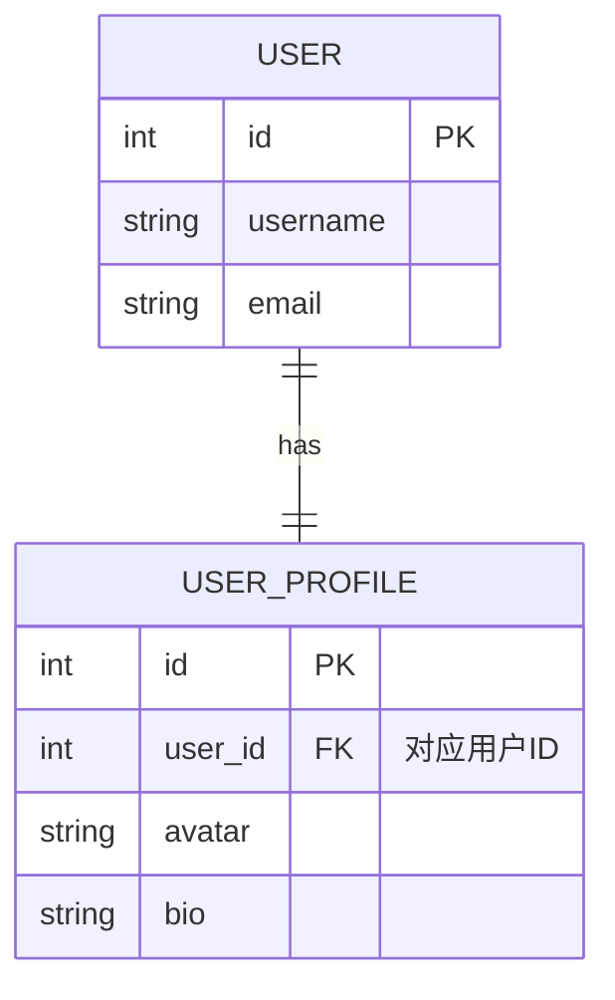
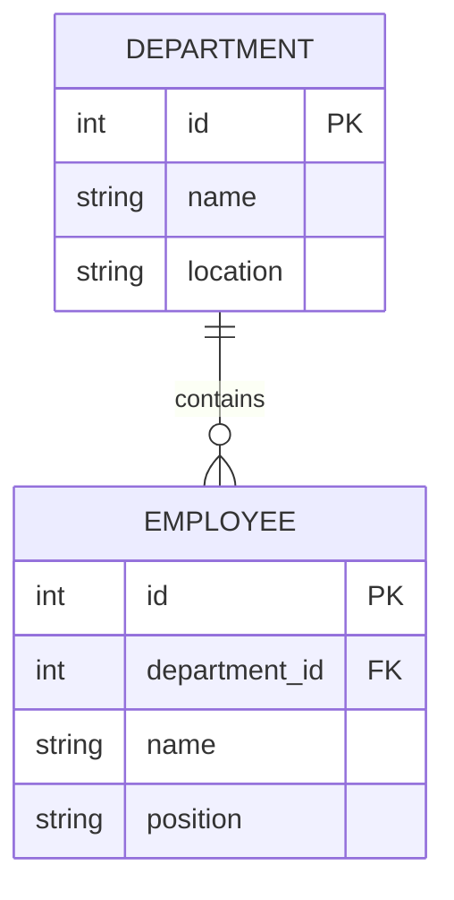
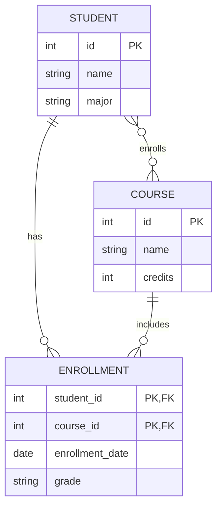

# 关系

## 关系模型

在数据库关系模型中：

- 表（Table）：对应现实世界中的一个“实体集合”
- 行（Row）：一条实体记录
- 列（Column）：实体的属性
- 主键（Primary Key）：唯一标识一条记录的属性
- 外键（Foreign Key）：用于建立表与表之间关系的属性

数据库中最常见的实体关系模型：

- 一对一 (One-to-One)
- 一对多(One-to-Many)
- 多对多 (Many-to-Many)

一对一，表示表 A 的一条记录对应表 B 的一条记录，反之亦然。例如，每个用户对应一个用户资料。

## ERD

- [Entity Relationship Diagram (ERD) Tutorial - Part 1](https://www.youtube.com/watch?v=xsg9BDiwiJE)
- [Entity Relationship Diagram (ERD) Tutorial - Part 2](https://www.youtube.com/watch?v=hktyW5Lp0Vo)

Entity Relationship Diagram (ER 图) 是一种用于表示实体及其关系的图形化工具。

一对一：

一对多：

多对多：

